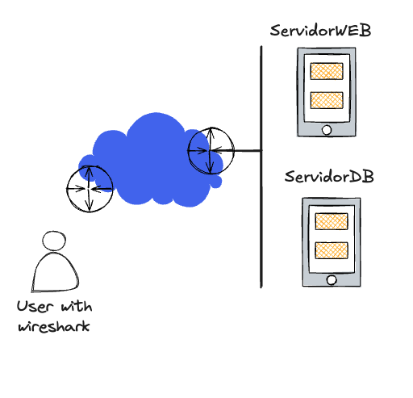

Estrutura do ambeinte 

# Laboratorio Cripto e SegRedes

## Nova Topologia proposta temporaria:

## Inventario da bagaça:

| Name | State | Public IP | Private IP | Shape | OCPU count | Memory (GB) |
|---|---|---|---|---|---|---|
| ServidorWEB | Running | 144.33.8.112 | 172.31.123.59 | VM.Standard.E2.1.Micro | 1 | 1 |
| ServidorDB | Running | 144.33.31.48 | 172.31.123.6 | VM.Standard.E2.1.Micro | 1 | 1 |
