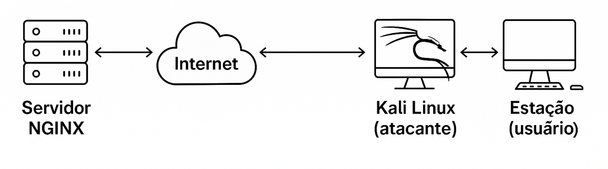

# Objetivo da Aula: Interceptar Senha HTTP e Proteger com HTTPS

Nesta aula, vamos demonstrar:

1. A construção de um servidor web com autenticação HTTP básica (sem criptografia)
2. Como interceptar credenciais de autenticação com uma máquina atacante (ex: Kali Linux)
3. Como proteger os dados ativando HTTPS com Certbot (Let's Encrypt)
4. Repetir o teste com HTTPS e analisar a segurança

---

## Topologia da Rede

Servidor NGINX --- Internet --- Kali Linux (atacante) --- Estação (usuário)


---

## Etapa 1 – Instalar o Servidor Web (NGINX)

```bash
sudo apt update
sudo apt install nginx -y
```

Verificar:

```bash
systemctl status nginx
```

---

## Etapa 2 – Criar diretórios dos sites

```bash
sudo mkdir -p /var/www/site1.faznada.xyz/public_html
sudo mkdir -p /var/www/site2.faznada.xyz/public_html
sudo mkdir -p /var/www/site3.faznada.xyz/public_html
```

Conteúdo de exemplo:

```bash
echo "<h1>Site 1</h1>" | sudo tee /var/www/site1.faznada.xyz/public_html/index.html
echo "<h1>Site 2</h1>" | sudo tee /var/www/site2.faznada.xyz/public_html/index.html
echo "<h1>Site 3</h1>" | sudo tee /var/www/site3.faznada.xyz/public_html/index.html

```

Permissões:

```bash
sudo chown -R $USER:$USER /var/www/site*
```

---

## Etapa 3 – Criar Virtual Hosts no NGINX

### site1.faznada.xyz

```bash
sudo nano /etc/nginx/sites-available/site1.faznada.xyz
```

```nginx
server {
    listen 80;
    server_name site1.faznada.xyz;
    root /var/www/site1.faznada.xyz/public_html;
    index index.html;
    location / {
        try_files $uri $uri/ =404;
    }
}
```

Repita para site2 e site3 alterando server_name e root.

---

## Etapa 4 – Ativar os sites

```bash
sudo ln -s /etc/nginx/sites-available/site1.faznada.xyz /etc/nginx/sites-enabled/
sudo ln -s /etc/nginx/sites-available/site2.faznada.xyz /etc/nginx/sites-enabled/
sudo ln -s /etc/nginx/sites-available/site3.faznada.xyz /etc/nginx/sites-enabled/
sudo nginx -t
sudo systemctl reload nginx
```

---

## Etapa 5 – Criar site com autenticação (sem HTTPS)

### Instalar PHP e utilitários

```bash
sudo apt install php-fpm php-cli apache2-utils -y
```

### Criar site com login

```bash
sudo mkdir -p /var/www/siteauth.faznada.xyz/public_html
echo "<?php echo '<h1>Área Restrita em PHP</h1>'; ?>" | sudo tee /var/www/siteauth.faznada.xyz/public_html/index.php
sudo chown -R $USER:$USER /var/www/siteauth.faznada.xyz
```

### Criar senha local

```bash
sudo htpasswd -c /etc/nginx/.htpasswd usuario1
```

### Configurar vhost com autenticação

```bash
sudo nano /etc/nginx/sites-available/siteauth.faznada.xyz
```

```nginx
server {
    listen 80;
    server_name siteauth.faznada.xyz;

    root /var/www/siteauth.faznada.xyz/public_html;
    index index.php;

    location / {
        auth_basic "Área Restrita";
        auth_basic_user_file /etc/nginx/.htpasswd;
        try_files $uri $uri/ =404;
    }

    location ~ \.php$ {
        include snippets/fastcgi-php.conf;
        fastcgi_pass unix:/run/php/php8.3-fpm.sock;
    }

    location ~ /\.ht {
        deny all;
    }
}
```

### Ativar o vhost

```bash
sudo ln -s /etc/nginx/sites-available/siteauth.faznada.xyz /etc/nginx/sites-enabled/
sudo nginx -t
sudo systemctl reload nginx
```

---

## Etapa 6 – Teste: Captura de Credenciais

Acesse http://siteauth.faznada.xyz pela estação, e use o Kali Linux com tcpdump, Wireshark ou ettercap para capturar a senha em texto claro.

Resultado esperado: a senha aparece visível na rede.

---

## Etapa 7 – Proteger com Certificados SSL

### Emitir certificado com Certbot para todos os domínios:

```bash
sudo apt install certbot python3-certbot-nginx -y

sudo certbot --nginx \
  -d site1.faznada.xyz \
  -d site2.faznada.xyz \
  -d site3.faznada.xyz \
  -d siteauth.faznada.xyz
```

---

### Testar renovação automática

```bash
sudo certbot renew --dry-run
```

---

### Pré-requisitos obrigatórios

- Domínios apontando para o IP do servidor
- Portas 80 e 443 liberadas no firewall
- NGINX com listen 80; configurado corretamente

---

## Etapa 8 – Repetir o ataque com HTTPS

Repita o acesso ao https://siteauth.faznada.xyz pela estação e tente capturar a senha novamente.

Resultado esperado: a senha não será visível na rede, pois está protegida via TLS.

---

## Conclusão da Aula

- HTTP transmite senhas em texto plano — fácil de interceptar
- HTTPS com Let's Encrypt protege contra sniffing de rede
- A autenticação deve sempre ser feita sob conexão segura
