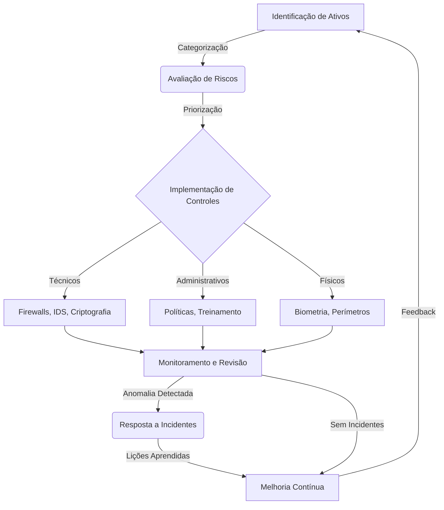
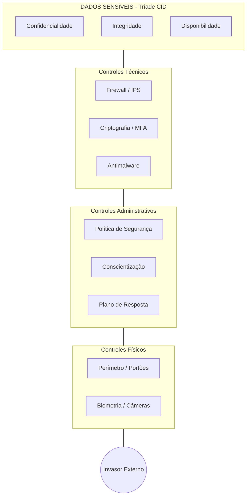
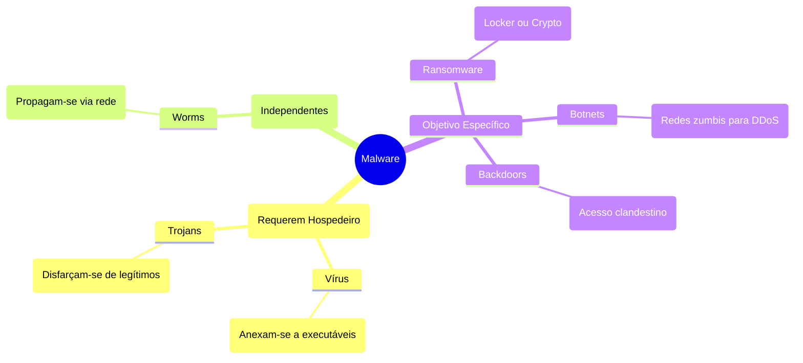

# Wiki Técnica — Introdução à Segurança de Redes para Profissionais de Infraestrutura

> Material expandido com base no documento **“Introdução à Segurança de Redes — SENAI”**, contemplando os fundamentos da Segurança da Informação, os pilares CID, princípios complementares, controles de segurança, ciclo de vida, ataques internos e externos, e taxonomia de malwares.

---

## 1. Finalidade da Segurança de Redes

A segurança de redes consiste no conjunto de princípios, controles, processos e tecnologias destinados a proteger dados, serviços, sistemas e fluxos de comunicação contra acessos indevidos, alterações não autorizadas, indisponibilidade, fraudes, vazamentos e comprometimentos operacionais.

Em ambiente corporativo, a rede não é apenas um meio de transporte de pacotes. Ela é a malha operacional que conecta usuários, aplicações, servidores, bancos de dados, nuvem, filiais, dispositivos móveis, sistemas legados, APIs, containers e serviços críticos. Por isso, qualquer fragilidade na rede pode converter-se em vetor de ataque.

A segurança de redes deve responder a três perguntas essenciais:

| Pergunta | Propósito técnico |
|---|---|
| Quem está acessando? | Validar identidade, origem, perfil e legitimidade |
| O que está sendo acessado? | Controlar ativos, serviços, dados e privilégios |
| Como esse acesso ocorre? | Monitorar tráfego, protocolos, comportamento e anomalias |

---

# 2. Fundamentos CID da Segurança da Informação

Os fundamentos clássicos da Segurança da Informação são estruturados pela tríade **CID**: **Confidencialidade, Integridade e Disponibilidade**.

Esses pilares não são conceitos abstratos. Eles se manifestam diariamente em firewalls, VPNs, autenticação, permissões, logs, backups, segmentação de rede, alta disponibilidade, criptografia, monitoramento e resposta a incidentes.

---

## 2.1 Confidencialidade

**Confidencialidade** é a propriedade que assegura que a informação seja acessada somente por pessoas, sistemas, processos ou entidades devidamente autorizadas.

Em termos práticos, significa impedir que dados corporativos, credenciais, documentos internos, informações pessoais, segredos industriais, prontuários, dados financeiros ou configurações sensíveis sejam expostos a quem não possui legitimidade de acesso.

### Como se manifesta em uma rede corporativa

Em uma empresa sob ataque, a quebra da confidencialidade pode ocorrer quando:

- um usuário acessa diretórios de rede sem necessidade funcional;
- credenciais são capturadas por phishing;
- tráfego sensível circula sem criptografia;
- backups ficam expostos em compartilhamentos inseguros;
- buckets, shares SMB, NFS ou volumes em nuvem são configurados como públicos;
- administradores utilizam contas compartilhadas;
- conexões remotas não exigem MFA;
- logs ou dumps de banco contêm senhas, tokens ou dados pessoais.

### Controles associados

| Controle | Aplicação prática |
|---|---|
| Criptografia em trânsito | TLS, VPN, SSH, IPsec |
| Criptografia em repouso | Discos, bancos, backups, storage |
| Autenticação forte | MFA, certificados, chaves SSH |
| Autorização granular | RBAC, ACLs, grupos, políticas IAM |
| Segmentação de rede | VLANs, sub-redes, zonas de segurança |
| DLP | Prevenção contra vazamento de dados |
| Classificação da informação | Público, interno, confidencial, restrito |

### Indicadores de quebra de confidencialidade

- download incomum de grandes volumes de dados;
- autenticação de usuário em horário atípico;
- acesso administrativo a arquivos fora do escopo funcional;
- tráfego de saída para destinos desconhecidos;
- uso anormal de ferramentas de compressão ou transferência;
- múltiplas tentativas de leitura em diretórios sensíveis.

---

## 2.2 Integridade

**Integridade** assegura que a informação permaneça correta, completa, íntegra e protegida contra alterações não autorizadas, acidentais ou maliciosas.

A integridade é essencial para garantir que aquilo que está armazenado, transmitido ou processado seja confiável.

### Como se manifesta em uma rede corporativa

A integridade é violada quando:

- arquivos são alterados indevidamente;
- registros de banco de dados são manipulados;
- pacotes de rede são interceptados e modificados;
- scripts de automação são adulterados;
- imagens de containers são substituídas por versões maliciosas;
- configurações de firewall, DNS ou roteamento são modificadas sem autorização;
- logs são apagados ou alterados para ocultar rastros.

### Controles associados

| Controle | Função |
|---|---|
| Hashes criptográficos | Verificar se arquivo ou pacote foi alterado |
| Assinaturas digitais | Garantir autoria e integridade |
| Controle de versão | Rastrear mudanças em código e configuração |
| Gestão de mudanças | Aprovar alterações antes da aplicação |
| Logs imutáveis | Evitar adulteração de evidências |
| EDR/XDR | Detectar alteração maliciosa em endpoints |
| Monitoramento de configuração | Identificar drift e mudanças indevidas |

### Exemplo corporativo

Um invasor obtém acesso a um servidor Linux e altera um script de backup para copiar os dados para um destino externo antes da execução normal. O backup continua funcionando, mas o processo foi adulterado. A disponibilidade permanece aparente, porém a integridade do processo foi comprometida.

---

## 2.3 Disponibilidade

**Disponibilidade** é a propriedade que garante que sistemas, redes, serviços e dados estejam acessíveis aos usuários autorizados quando necessários.

A indisponibilidade pode decorrer de falhas técnicas, erro humano, desastre físico, ataque cibernético, saturação de recursos ou má arquitetura.

### Como se manifesta em uma rede corporativa

A disponibilidade é afetada quando:

- um ataque DDoS consome banda ou recursos;
- um ransomware bloqueia acesso a dados;
- um firewall mal configurado interrompe comunicação crítica;
- storage ou banco de dados fica inacessível;
- falhas de DNS impedem acesso a aplicações;
- loops de rede derrubam switches;
- falta de redundância causa ponto único de falha;
- backups existem, mas não são restauráveis.

### Controles associados

| Controle | Aplicação prática |
|---|---|
| Alta disponibilidade | Cluster, failover, balanceadores |
| Redundância | Links, fontes, storage, switches, firewalls |
| Backup e restore testado | Recuperação real, não apenas cópia |
| Monitoramento | Métricas, alertas, logs, traces |
| Proteção DDoS | Filtragem, scrubbing, rate limiting |
| Capacity planning | Prevenção de saturação |
| Plano de continuidade | Procedimentos formais de recuperação |

### Indicadores de ameaça à disponibilidade

- aumento repentino de conexões;
- consumo anormal de CPU, memória, I/O ou rede;
- falhas repetidas de autenticação;
- indisponibilidade intermitente de serviços;
- crescimento inesperado de filas, sessões ou processos;
- lentidão generalizada após mudança de configuração.

---

# 3. Princípios Complementares de Segurança

Além do CID, a segurança moderna exige outros princípios indispensáveis: **Autenticidade, Não Repúdio, Conformidade e Confiabilidade**.

---

## 3.1 Autenticidade

**Autenticidade** garante que uma entidade, mensagem, sistema, usuário ou transação seja genuína e proveniente de origem legítima.

Em segurança de redes, autenticidade responde à pergunta: **“este acesso é realmente de quem diz ser?”**

### Manifestações práticas

- login com usuário e senha;
- autenticação multifator;
- certificados digitais;
- chaves SSH;
- assinatura de pacotes;
- autenticação mútua entre aplicações;
- validação de origem em APIs.

### Riscos quando ausente

| Falha | Consequência |
|---|---|
| Senhas fracas | Tomada de contas |
| Ausência de MFA | Uso indevido de credenciais vazadas |
| Certificados inválidos | Ataques man-in-the-middle |
| APIs sem autenticação robusta | Exposição de dados e funções críticas |
| Contas compartilhadas | Impossibilidade de atribuir responsabilidade |

### Em ambiente sob ataque

Um atacante pode utilizar credenciais legítimas obtidas por phishing. Para o sistema, o acesso parece autêntico. Por isso, a autenticidade moderna não deve depender apenas de senha, mas também de contexto, dispositivo, localização, horário, comportamento e fator adicional.

---

## 3.2 Não Repúdio ou Irretratabilidade

**Não repúdio** é a propriedade que impede que uma parte negue a autoria de uma ação, transação, comando, alteração ou comunicação.

Em infraestrutura, não repúdio depende de registros tecnicamente confiáveis.

### Elementos essenciais

| Elemento | Finalidade |
|---|---|
| Logs de autenticação | Identificar quem acessou |
| Logs de autorização | Identificar o que foi permitido |
| Logs de alteração | Identificar o que foi modificado |
| Trilhas de auditoria | Reconstruir sequência dos fatos |
| Carimbo de tempo | Determinar quando ocorreu |
| Assinatura digital | Vincular autoria e integridade |
| Centralização de logs | Evitar perda ou manipulação local |

### Exemplo prático

Se uma regra de firewall é alterada e expõe uma porta administrativa à internet, a organização precisa saber:

- quem alterou;
- quando alterou;
- de onde alterou;
- qual era a regra anterior;
- qual foi a justificativa;
- se houve aprovação;
- se a mudança gerou incidente.

Sem não repúdio, a apuração técnica fica frágil e a responsabilização torna-se incerta.

---

## 3.3 Conformidade

**Conformidade** é a aderência a leis, normas, políticas internas, contratos, padrões técnicos e exigências regulatórias.

No Brasil, a LGPD possui relevância direta para ambientes que tratam dados pessoais. Em ambientes corporativos, também podem incidir ISO/IEC 27001, ISO/IEC 27002, PCI-DSS, normas internas, políticas de fornecedores, requisitos de auditoria e obrigações contratuais.

### Conformidade não é apenas documentação

Uma política de segurança sem aplicação técnica é apenas uma declaração formal. A conformidade exige evidência.

| Exigência | Evidência técnica esperada |
|---|---|
| Controle de acesso | Relatórios de usuários, grupos e permissões |
| Backup | Logs de execução e testes de restauração |
| Gestão de incidentes | Registros de abertura, contenção e lições aprendidas |
| Criptografia | Configurações, certificados e inventário |
| Retenção de logs | Política, armazenamento e integridade |
| Treinamento | Registros de participação e reciclagem |
| Gestão de vulnerabilidades | Relatórios, classificação e plano de correção |

### Em ambiente sob ataque

A falta de conformidade aumenta o impacto jurídico, regulatório, operacional e reputacional. Um incidente com dados pessoais, por exemplo, não é apenas uma ocorrência técnica: pode exigir comunicação, investigação, preservação de evidências, avaliação de risco aos titulares e medidas corretivas documentadas.

---

## 3.4 Confiabilidade ou Reliability

**Confiabilidade** é a capacidade de um sistema operar de forma previsível, segura e resistente, mesmo sob falha, pressão, ataque ou degradação parcial.

Um sistema confiável não é aquele que nunca falha. É aquele que falha de modo controlado, detectável e recuperável.

### Características de sistemas confiáveis

- comportamento previsível;
- tolerância a falhas;
- isolamento de impacto;
- observabilidade;
- recuperação testada;
- redução de pontos únicos de falha;
- controles proporcionais ao risco;
- documentação operacional;
- melhoria contínua.

### Relação com resiliência

A confiabilidade é a base da resiliência. A resiliência é a capacidade de resistir, absorver, recuperar e evoluir após eventos adversos.

| Dimensão | Pergunta técnica |
|---|---|
| Resistir | O ataque pode ser bloqueado ou reduzido? |
| Absorver | O sistema continua operando parcialmente? |
| Recuperar | Há backup, failover ou restauração validada? |
| Aprender | O incidente gera melhoria de arquitetura? |

---

# 4. Ataques Internos e Externos

A origem do ataque influencia a detecção, a contenção e a resposta.

---

## 4.1 Ataques Internos

**Ataques internos** são originados por agentes que já possuem algum nível de acesso legítimo à organização.

Podem envolver funcionários, prestadores, administradores, desenvolvedores, terceiros, parceiros, fornecedores ou contas comprometidas de usuários internos.

### Características

| Aspecto | Descrição |
|---|---|
| Origem | Dentro da organização ou usando credencial interna |
| Acesso inicial | Geralmente legítimo |
| Detecção | Mais difícil, pois o tráfego parece autorizado |
| Conhecimento do ambiente | Alto |
| Potencial de dano | Elevado |
| Motivação | Vingança, fraude, curiosidade, erro, coerção, ganho financeiro |

### Manifestações práticas

- cópia indevida de bases de dados;
- alteração de permissões;
- uso de credenciais administrativas fora de janela aprovada;
- exfiltração por e-mail, nuvem pessoal ou pendrive;
- desativação de logs;
- criação de contas ocultas;
- manipulação de backup;
- alteração de regras de firewall;
- acesso a sistemas fora da função do usuário.

### Mitigações recomendadas

- princípio do menor privilégio;
- segregação de funções;
- revisão periódica de acessos;
- MFA para contas privilegiadas;
- PAM para credenciais administrativas;
- logs centralizados e imutáveis;
- UEBA para comportamento anômalo;
- DLP;
- bloqueio de mídias removíveis;
- gestão formal de desligamento e mudança de função.

---

## 4.2 Ataques Externos

**Ataques externos** são conduzidos por agentes sem acesso autorizado inicial, que tentam comprometer a organização a partir de fora.

### Características

| Aspecto | Descrição |
|---|---|
| Origem | Internet, terceiros, redes externas |
| Acesso inicial | Não autorizado |
| Vetores comuns | Phishing, exploração de vulnerabilidades, credenciais vazadas |
| Detecção | Pode ser mais visível em logs de borda |
| Objetivo | Ganhar acesso, persistir, escalar privilégios, exfiltrar ou interromper |

### Manifestações práticas

- varreduras de portas;
- tentativas de login em VPN, SSH, RDP, painéis web;
- exploração de CVEs;
- phishing com captura de senha;
- abuso de APIs públicas;
- exploração de aplicações web;
- DDoS;
- tentativa de acesso a buckets, repositórios ou painéis expostos.

### Mitigações recomendadas

- WAF;
- firewall de borda;
- IDS/IPS;
- hardening de serviços expostos;
- MFA em acessos remotos;
- gestão de vulnerabilidades;
- atualização contínua;
- rate limiting;
- proteção DDoS;
- segmentação entre DMZ e rede interna;
- bloqueio geográfico quando aplicável;
- monitoramento de reputação de IPs.

---

# 5. Taxonomia de Malware

Malware é qualquer software desenvolvido ou utilizado para causar dano, obter acesso indevido, roubar informação, interromper serviços, espionar, fraudar, persistir ou controlar sistemas sem autorização.

---

## 5.1 Tabela comparativa de malwares

| Tipo | Replicação própria | Depende de usuário | Propagação em rede | Objetivo típico | Exemplo de impacto |
|---|---:|---:|---:|---|---|
| Trojan | Não | Sim | Pode ocorrer indiretamente | Enganar e abrir acesso | Backdoor, roubo de dados |
| Vírus | Sim, ao infectar arquivos | Sim, geralmente execução | Limitada | Infectar arquivos e sistemas | Corrupção de dados |
| Worm | Sim | Não necessariamente | Sim | Propagação automática | Saturação de rede |
| Ransomware Locker | Não é a característica central | Pode iniciar por phishing | Pode se espalhar lateralmente | Bloquear sistema | Usuário sem acesso ao SO |
| Ransomware Crypto | Não é a característica central | Pode iniciar por phishing | Pode atingir shares e servidores | Criptografar dados | Arquivos inacessíveis |
| Botnet | Malware controla o host | Variável | Sim | Controle coordenado | DDoS, spam, mineração |
| Backdoor | Não necessariamente | Não necessariamente | Permite retorno | Persistência e acesso remoto | Controle oculto |

---

## 5.2 Trojans

**Trojans**, ou Cavalos de Troia, são malwares disfarçados de software legítimo. Eles dependem da confiança ou descuido do usuário para serem executados.

### Como operam

Um Trojan normalmente:

1. apresenta-se como aplicativo útil, instalador, atualização, documento ou ferramenta;
2. é executado pelo usuário ou por processo induzido;
3. instala componente malicioso;
4. abre canal de comunicação;
5. permite roubo de dados, controle remoto ou instalação de outros malwares.

### Manifestações corporativas

- suposta atualização de software enviada por e-mail;
- ferramenta administrativa falsa;
- instalador baixado fora do repositório oficial;
- crack, keygen ou utilitário não autorizado;
- anexo aparentemente legítimo;
- pacote inserido em repositório comprometido.

### Controles eficazes

- allowlisting de aplicações;
- EDR;
- bloqueio de execução em diretórios temporários;
- restrição de privilégios locais;
- treinamento contra phishing;
- análise de anexos;
- proxy com inspeção;
- política de instalação de software;
- repositórios oficiais e assinatura de pacotes.

---

## 5.3 Vírus

**Vírus** são programas maliciosos que infectam arquivos, scripts ou executáveis, replicando-se quando o arquivo infectado é executado.

### Como operam

O vírus depende de um hospedeiro. Ele se anexa a um arquivo ou programa e é ativado quando esse elemento é executado.

### Manifestações corporativas

- documentos com macros maliciosas;
- executáveis infectados em compartilhamentos;
- scripts adulterados;
- arquivos trafegando por e-mail ou mídias removíveis;
- estações sem proteção atualizada.

### Impactos

- corrupção de arquivos;
- indisponibilidade de estações;
- propagação em shares;
- alteração de binários;
- perda de confiança em arquivos corporativos.

### Mitigações

- antimalware atualizado;
- bloqueio de macros não assinadas;
- controle de execução;
- atualização de sistemas;
- segregação de permissões em compartilhamentos;
- varredura periódica;
- backup versionado.

---

## 5.4 Worms

**Worms** são malwares autônomos capazes de se propagar pela rede sem depender diretamente da ação do usuário.

### Como operam

Worms exploram vulnerabilidades, serviços expostos, senhas fracas ou protocolos mal configurados para se multiplicar rapidamente.

### Manifestações corporativas

- tráfego lateral anormal entre estações;
- aumento súbito de conexões SMB, RDP, SSH ou RPC;
- consumo elevado de banda;
- múltiplos hosts com sintomas semelhantes;
- criação de processos suspeitos em massa;
- alertas simultâneos em várias sub-redes.

### Riscos específicos em redes

A interconectividade acelera o dano. Quanto mais plana for a rede, maior a superfície de propagação.

| Arquitetura | Efeito sobre worms |
|---|---|
| Rede plana | Propagação rápida |
| Segmentação por VLAN | Redução do alcance |
| Microsegmentação | Contenção mais precisa |
| Zero Trust | Menor confiança implícita |
| IDS lateral | Detecção de movimentação anômala |

### Mitigações

- patch management;
- segmentação de rede;
- bloqueio de portas desnecessárias;
- IDS/IPS;
- EDR;
- limitação de tráfego lateral;
- hardening de serviços;
- desativação de protocolos obsoletos;
- gestão de vulnerabilidades.

---

## 5.5 Ransomware

**Ransomware** é malware voltado a extorquir a organização por meio do bloqueio de sistemas, criptografia de dados ou ameaça de exposição pública de informações.

O ransomware moderno raramente é um evento instantâneo. Normalmente há fases anteriores: reconhecimento, acesso inicial, persistência, elevação de privilégio, movimentação lateral, desativação de defesas, comprometimento de backups, exfiltração e, por fim, bloqueio ou criptografia.

---

### 5.5.1 Ransomware Locker

**Locker ransomware** bloqueia o acesso ao sistema, impedindo o usuário de utilizar o dispositivo ou interface operacional.

#### Manifestação

- tela de bloqueio;
- impossibilidade de login;
- bloqueio do sistema operacional;
- restrição de acesso ao ambiente gráfico;
- ameaça de pagamento para liberação.

#### Impacto

Gera indisponibilidade imediata do endpoint, mas nem sempre criptografa todos os arquivos.

---

### 5.5.2 Ransomware Crypto

**Crypto ransomware** criptografa arquivos, bancos, diretórios compartilhados ou volumes acessíveis, tornando os dados indisponíveis.

#### Manifestação

- extensão de arquivos alterada;
- arquivos inacessíveis;
- nota de resgate;
- alto I/O em servidores de arquivos;
- picos de escrita;
- alteração massiva de arquivos;
- shadow copies removidas;
- backups atacados.

#### Impacto

É mais grave que o locker quando atinge dados críticos, bancos, storage, NFS, SMB, snapshots ou ambientes de backup.

---

### 5.5.3 Ransomware com Exfiltração

Além de criptografar, o atacante copia dados antes do bloqueio e ameaça divulgá-los.

#### Implicação

Mesmo que a organização restaure os dados por backup, ainda poderá enfrentar:

- vazamento de informações;
- exposição regulatória;
- dano reputacional;
- impacto contratual;
- necessidade de resposta jurídica e comunicação institucional.

---

### 5.5.4 Controles contra ransomware

| Camada | Controle |
|---|---|
| Identidade | MFA, PAM, bloqueio de contas privilegiadas |
| Endpoint | EDR, allowlisting, proteção contra alteração massiva |
| Rede | Segmentação, bloqueio lateral, IDS/IPS |
| Dados | Backup imutável, snapshots protegidos, versionamento |
| Operação | Plano de resposta, simulações, runbooks |
| Monitoramento | Alertas de I/O, exclusão de snapshots, criação massiva de arquivos |
| Administração | Menor privilégio, contas separadas, revisão de acessos |

---

## 5.6 Botnets

**Botnets** são redes de dispositivos comprometidos controlados remotamente por atacante ou grupo criminoso.

### Como operam

Um dispositivo infectado passa a receber comandos de uma infraestrutura de comando e controle. Ele pode executar ações coordenadas sem conhecimento do usuário ou administrador.

### Usos comuns

- DDoS;
- envio de spam;
- mineração de criptomoedas;
- roubo de credenciais;
- proxy para ataques;
- movimentação maliciosa distribuída;
- fraude.

### Manifestações corporativas

- tráfego de saída para domínios suspeitos;
- comunicação periódica com servidores externos;
- uso anormal de CPU;
- conexões para portas incomuns;
- alertas de reputação de IP;
- dispositivos IoT gerando tráfego indevido.

### Mitigações

- bloqueio de comunicação C2;
- DNS filtering;
- EDR;
- inventário de ativos;
- segmentação de IoT;
- atualização de firmware;
- bloqueio de saída desnecessária;
- análise de NetFlow;
- proxy autenticado.

---

# 6. Matriz de Defesa: Controles Técnicos, Administrativos e Físicos

A segurança efetiva depende da combinação de controles. Nenhum controle isolado é suficiente.

---

## 6.1 Controles Técnicos

São controles implementados por tecnologia.

| Controle | Finalidade | Exemplo prático |
|---|---|---|
| Firewall | Filtrar tráfego | Bloquear portas administrativas externas |
| IDS | Detectar intrusão | Alertar varredura ou exploração |
| IPS | Prevenir intrusão | Bloquear tráfego malicioso |
| Antimalware | Detectar código malicioso | Remover Trojan em endpoint |
| EDR/XDR | Detectar comportamento anômalo | Identificar ransomware em execução |
| Criptografia | Proteger dados | TLS, disco criptografado |
| SIEM | Correlacionar eventos | Unificar logs de firewall, AD, Linux |
| WAF | Proteger aplicações web | Bloquear exploração de aplicação |
| NAC | Controlar acesso à rede | Impedir dispositivo não autorizado |
| MFA | Reforçar autenticação | Proteger VPN e painéis administrativos |

---

## 6.2 Controles Administrativos

São políticas, processos, normas, papéis e procedimentos.

| Controle | Finalidade | Exemplo prático |
|---|---|---|
| PSI | Definir diretrizes | Política de senha, acesso remoto e backup |
| Gestão de incidentes | Responder a eventos | Fluxo de contenção e comunicação |
| Gestão de mudanças | Reduzir risco operacional | Aprovação antes de alterar firewall |
| Gestão de vulnerabilidades | Corrigir falhas | Priorização por criticidade |
| Treinamento | Reduzir erro humano | Campanhas contra phishing |
| Classificação da informação | Definir proteção por criticidade | Dados públicos, internos, restritos |
| Plano de continuidade | Manter operação | DRP, BCP e testes |
| Revisão de acessos | Reduzir privilégios indevidos | Revisão trimestral de grupos |

---

## 6.3 Controles Físicos

São controles destinados à proteção do ambiente material onde os ativos estão localizados.

| Controle | Finalidade | Exemplo prático |
|---|---|---|
| Perímetro físico | Restringir entrada | Muros, recepção, sala-cofre |
| Controle de acesso | Autorizar presença | Crachá, biometria, catraca |
| CFTV | Registrar eventos | Monitoramento de sala técnica |
| Sensores | Detectar risco | Temperatura, fumaça, movimento |
| Energia redundante | Garantir disponibilidade | Nobreak, gerador |
| Combate a incêndio | Proteger ativos | Detecção e supressão |
| Proteção contra inundação | Preservar continuidade | Piso elevado, drenagem, sensores |

---

# 7. Ciclo de Vida da Segurança da Informação

A segurança não é um produto instalado. É um processo permanente, cíclico e orientado por risco.

---

## 7.1 Identificação de Ativos

A organização deve conhecer seus ativos antes de protegê-los.

### Ativos típicos

- servidores físicos;
- máquinas virtuais;
- containers;
- clusters Kubernetes;
- bancos de dados;
- storages;
- firewalls;
- switches;
- roteadores;
- endpoints;
- aplicações;
- APIs;
- contas privilegiadas;
- certificados;
- chaves;
- backups;
- logs;
- dados pessoais;
- documentos estratégicos.

### Perguntas fundamentais

- Onde está o ativo?
- Quem é o responsável?
- Qual sua criticidade?
- Que dados processa?
- Quais dependências possui?
- Está exposto à internet?
- Possui backup?
- Possui monitoramento?
- Tem vulnerabilidades conhecidas?

---

## 7.2 Avaliação de Risco

A avaliação de risco mede a relação entre ameaça, vulnerabilidade, probabilidade e impacto.

### Fórmula conceitual

```text
Risco = Probabilidade x Impacto
```

### Exemplo

| Cenário | Probabilidade | Impacto | Risco |
|---|---|---|---|
| Servidor legado exposto à internet | Alta | Alto | Crítico |
| Estação sem antivírus em rede isolada | Média | Médio | Moderado |
| Aplicação interna sem MFA | Alta | Alto | Alto |
| Backup sem teste de restore | Média | Crítico | Alto |
| Porta SSH exposta com senha | Alta | Alto | Crítico |

### Critérios de priorização

- exposição externa;
- existência de exploit conhecido;
- criticidade do ativo;
- sensibilidade dos dados;
- facilidade de exploração;
- impacto em disponibilidade;
- impacto regulatório;
- presença de controles compensatórios.

---

## 7.3 Implementação de Controles

Após identificar riscos, a organização deve selecionar controles proporcionais.

### Estratégias de tratamento

| Estratégia | Significado | Exemplo |
|---|---|---|
| Mitigar | Reduzir risco | Aplicar patch, MFA, firewall |
| Transferir | Repassar parte do risco | Seguro cibernético, contrato |
| Aceitar | Assumir formalmente | Risco baixo documentado |
| Evitar | Eliminar exposição | Desativar serviço inseguro |

---

## 7.4 Monitoramento e Revisão

Monitoramento é o mecanismo que transforma controles estáticos em defesa ativa.

### Fontes relevantes

- logs de firewall;
- logs de VPN;
- Active Directory;
- Linux auth logs;
- EDR;
- IDS/IPS;
- DNS;
- proxy;
- Kubernetes audit logs;
- cloud logs;
- NetFlow;
- logs de aplicação;
- banco de dados;
- storage;
- backup.

### Indicadores de atenção

| Indicador | Possível interpretação |
|---|---|
| Muitas falhas de login | Ataque de força bruta ou senha vazada |
| Login fora de horário | Conta comprometida |
| Alto tráfego de saída | Exfiltração |
| Criação de usuário admin | Persistência |
| Desativação de antivírus | Preparação para ataque |
| Exclusão de logs | Ocultação de rastros |
| Alteração massiva de arquivos | Ransomware |
| Conexões laterais incomuns | Worm ou movimentação lateral |

---

## 7.5 Resposta a Incidentes

Resposta a incidentes é a capacidade de agir rapidamente para conter, erradicar e recuperar.

### Fases recomendadas

| Fase | Objetivo |
|---|---|
| Preparação | Ter plano, equipe, ferramentas e contatos |
| Identificação | Confirmar incidente e escopo |
| Contenção | Impedir expansão |
| Erradicação | Remover causa e persistência |
| Recuperação | Restaurar operação segura |
| Lições aprendidas | Corrigir processo e arquitetura |

### Exemplo aplicado: ransomware

| Fase | Ação defensiva |
|---|---|
| Identificação | Detectar alteração massiva de arquivos |
| Contenção | Isolar host, bloquear credenciais, segmentar rede |
| Erradicação | Remover malware e persistência |
| Recuperação | Restaurar backup limpo |
| Revisão | Fechar vetor inicial e reforçar controles |

---

## 7.6 Melhoria Contínua

A melhoria contínua exige dados, métricas e revisão periódica.

### Métricas úteis

| Métrica | Finalidade |
|---|---|
| MTTD | Tempo médio para detectar |
| MTTR | Tempo médio para responder |
| RTO | Tempo máximo aceitável de recuperação |
| RPO | Perda máxima aceitável de dados |
| Taxa de correção de vulnerabilidades | Efetividade de patching |
| Cobertura de logs | Visibilidade |
| Taxa de sucesso de backup | Proteção de dados |
| Resultado de phishing simulado | Maturidade do usuário |
| Incidentes recorrentes | Falha de causa raiz |

---

# 8. Rede, Tráfego e Identificação de Brechas

A rede revela o comportamento real do ambiente. Mesmo quando endpoints são comprometidos, o tráfego frequentemente denuncia reconhecimento, movimentação lateral, exfiltração ou comando e controle.

---

## 8.1 Superfície de ataque de rede

| Componente | Brecha comum | Mitigação |
|---|---|---|
| VPN | Conta sem MFA | MFA, postura de dispositivo |
| SSH | Senha fraca ou porta exposta | Chaves, bastion, allowlist |
| RDP | Exposição externa | Gateway, MFA, bloqueio externo |
| SMB/NFS | Permissões excessivas | ACL, segmentação, auditoria |
| DNS | Túnel ou resolução maliciosa | DNS filtering, logs |
| APIs | Autenticação fraca | OAuth, rate limit, WAF |
| Kubernetes | API exposta | RBAC, network policies |
| Cloud storage | Bucket público | Policy review, CSPM |
| Firewall | Regras amplas | Revisão e menor privilégio |

---

## 8.2 Sinais de comprometimento no tráfego

| Sinal | Possível ameaça |
|---|---|
| Varredura de portas | Reconhecimento |
| Muitos SYN sem conclusão | DDoS ou scan |
| DNS para domínios recém-criados | Malware/C2 |
| Upload incomum | Exfiltração |
| Conexões laterais entre estações | Worm ou movimentação lateral |
| Tráfego criptografado para IP suspeito | Canal de comando |
| Acesso externo a painel administrativo | Tentativa de invasão |
| Picos de SMB | Ransomware ou cópia massiva |

---

# 9. Vulnerabilidades Internas e Externas

## 9.1 Vulnerabilidades internas

Vulnerabilidades internas são fragilidades exploráveis por quem já possui algum nível de acesso.

### Exemplos

- permissões excessivas em diretórios;
- contas sem expiração;
- usuários com privilégio administrativo local;
- senhas compartilhadas;
- ausência de segregação de funções;
- rede interna sem segmentação;
- logs locais sem centralização;
- backup acessível pelo mesmo domínio comprometido;
- ausência de revisão de acessos;
- serviços internos sem autenticação.

### Mitigação

- Zero Trust;
- menor privilégio;
- PAM;
- revisão periódica;
- segmentação;
- logs imutáveis;
- hardening;
- bloqueio de ferramentas não autorizadas;
- monitoramento comportamental.

---

## 9.2 Vulnerabilidades externas

Vulnerabilidades externas são fragilidades exploráveis por agentes fora da organização.

### Exemplos

- serviços expostos;
- aplicações desatualizadas;
- falhas conhecidas sem patch;
- credenciais vazadas;
- APIs públicas inseguras;
- VPN sem MFA;
- painéis administrativos na internet;
- buckets públicos;
- DNS mal configurado;
- certificados expirados ou inválidos.

### Mitigação

- gestão de exposição externa;
- varreduras periódicas;
- WAF;
- MFA;
- patching;
- hardening;
- redução de superfície;
- pentest;
- bug bounty quando aplicável;
- monitoramento de credenciais vazadas.

---

# 10. Matriz Prática de Resiliência

| Ameaça | CID afetado | Sinais | Controles preventivos | Controles detectivos | Controles corretivos |
|---|---|---|---|---|---|
| Phishing | Confidencialidade | Login suspeito | MFA, treinamento | SIEM, UEBA | Reset de senha, revogação de sessão |
| Ransomware | Disponibilidade/Integridade | Alteração massiva | EDR, menor privilégio | Alertas de I/O | Restore, contenção |
| Worm | Disponibilidade | Tráfego lateral | Patch, segmentação | IDS, NetFlow | Isolamento de rede |
| Insider | Confidencialidade/Integridade | Acesso fora do perfil | RBAC, DLP | Logs, UEBA | Revogação de acesso |
| DDoS | Disponibilidade | Pico de tráfego | Proteção DDoS | Monitoramento | Scrubbing, rate limit |
| Backdoor | Autenticidade/Integridade | Conexões persistentes | Hardening, revisão de código | EDR, IDS | Remoção e reinstalação segura |
| Botnet | Disponibilidade/Confiabilidade | C2, tráfego externo | DNS filtering | NetFlow, EDR | Quarentena e limpeza |

---

# 11. Checklist Operacional para Profissionais de Infraestrutura

## 11.1 Identidade e acesso

- Aplicar MFA em VPN, cloud, e-mail e painéis administrativos.
- Remover contas inativas.
- Separar contas pessoais de contas administrativas.
- Revisar grupos privilegiados.
- Implementar PAM para acessos críticos.
- Proibir contas compartilhadas.

## 11.2 Rede

- Segmentar ambientes por criticidade.
- Isolar servidores críticos.
- Bloquear tráfego lateral desnecessário.
- Revisar regras de firewall periodicamente.
- Monitorar DNS e conexões de saída.
- Proteger acessos remotos.

## 11.3 Servidores e endpoints

- Aplicar hardening.
- Manter patches atualizados.
- Instalar EDR/antimalware.
- Bloquear execução não autorizada.
- Auditar alterações de configuração.
- Remover serviços desnecessários.

## 11.4 Dados e backup

- Classificar dados.
- Criptografar dados sensíveis.
- Implementar backup versionado.
- Proteger backup contra alteração.
- Testar restauração.
- Definir RPO e RTO.

## 11.5 Monitoramento

- Centralizar logs.
- Correlacionar eventos.
- Criar alertas para comportamento anômalo.
- Monitorar autenticações.
- Monitorar tráfego de saída.
- Preservar logs críticos.

## 11.6 Resposta a incidentes

- Manter plano formal.
- Definir responsáveis.
- Criar runbooks.
- Simular incidentes.
- Documentar decisões.
- Realizar lições aprendidas.

---

# 12. Conclusão Técnica

A segurança de redes deve ser compreendida como uma disciplina permanente de proteção, vigilância, resposta e aprimoramento. Em ambientes corporativos modernos, a interconectividade amplia a produtividade, mas também expande a superfície de ataque.

A defesa eficaz exige equilíbrio entre **confidencialidade, integridade, disponibilidade, autenticidade, não repúdio, conformidade e confiabilidade**. Esses princípios precisam ser convertidos em controles reais, evidenciáveis e continuamente testados.

O profissional de infraestrutura, nesse contexto, não atua apenas como operador de servidores, redes ou sistemas. Atua como guardião da continuidade operacional, da confiança digital e da resiliência institucional. A maturidade em segurança não se mede pela existência de ferramentas isoladas, mas pela capacidade de identificar riscos, implementar controles proporcionais, detectar desvios, responder rapidamente e melhorar a arquitetura após cada evento.









