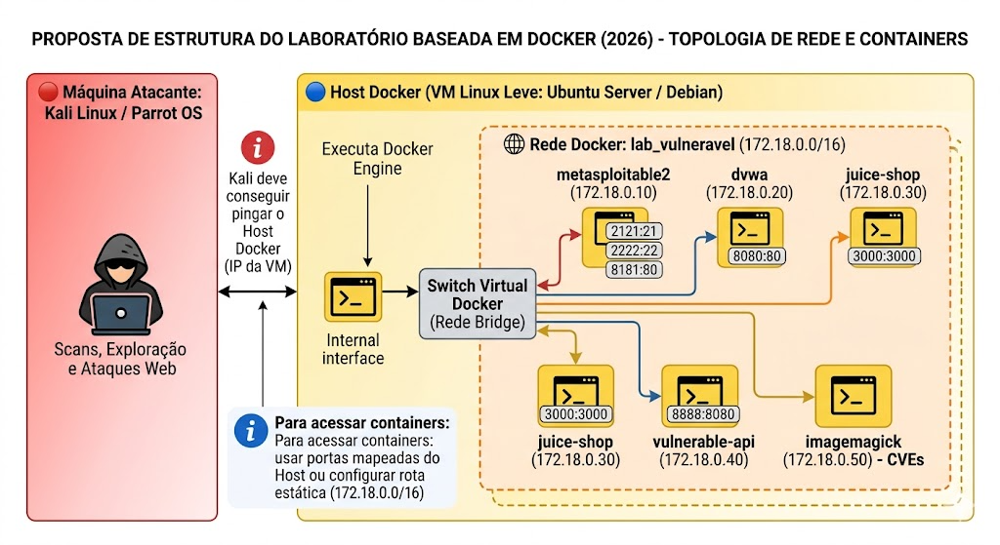

# Proposta de Estrutura do Laboratorio Baseada em Docker

**Autor:** Charles Alandt

**Contato:** `echo "Y2hhcmxlcy5hbGFuZHRAZ21haWwuY29tCg==" | base64 -d`

**Uso e atribuição:** este material pode ser copiado, adaptado e utilizado livremente para fins educacionais, desde que a fonte e o autor sejam referenciados.

---

> [!CAUTION]
> **AVISO DE ÉTICA E RESPONSABILIDADE**
> Este conteúdo e ambiente foram elaborados exclusivamente para fins educacionais, laboratoriais e de pesquisa em ambiente controlado.
>
> **Uso estritamente proibido** em sistemas de terceiros ou redes de produção sem autorização formal. O uso deste material em qualquer contexto que viole normas legais é de inteira responsabilidade do executor.
>
> **DISCLAIMER DE ESTABILIDADE E SUPORTE:**
> Este laboratório foi testado e validado pelo instrutor. No entanto, o ecossistema de TI (versões de kernels, imagens Docker e provedores do Vagrant) evolui rapidamente. 
> 
> **Fique atento:**
> - A execução é permitida apenas em laboratório isolado (VM dedicada, Docker Lab, NAT/Host-Only ou rede segregada).
> - Ambientes de laboratório são sensíveis e dependentes de hardware.
> - Falhas podem ocorrer devido a drivers, virtualização desativada (BIOS/VT-x) ou conflitos de rede local.
> - **Ajustes manuais podem ser necessários** durante o processo para adequar o lab à sua máquina específica.

---
## Visao geral

O laboratorio deixa de ser baseado em multiplas VMs e passa a utilizar:

- uma unica VM de gerenciamento (Host Docker);
- containers como alvos vulneraveis.

O Kali Linux atuara como maquina atacante, explorando uma rede virtual interna criada pelo Docker.

> Se voce quer montar esse laboratorio em **VirtualBox** (com 2 VMs: Host Docker + Kali), siga o guia: [Lab_no_VirtualBox_(HostDocker+Kali).md](<Aula 01 - 4 - Lab_no_VirtualBox_(HostDocker+Kali).md>).

---

## 1. Topologia recomendada (logica e rede)

Para garantir isolamento e simulacao realista, sera utilizada uma rede Docker do tipo `bridge`.

Sugestao:

Topologia do laboratorio Docker recomendada

<p align="center">
  
</p>

[Topologia do laboratorio Docker recomendada](imagens/topologia_lab_docker.png)

### 1.1 Estrutura logica

- Host Docker (VM principal);
- switch virtual Docker (rede interna);
- containers vulneraveis conectados a rede;
- Kali Linux acessando via rede do host.

### 1.2 Componentes da topologia

#### Host Docker (servidor de alvos)

- VM Linux leve (Ubuntu Server ou Debian);
- executa o Docker Engine;
- possui IP na rede do laboratorio.

#### Rede Docker `lab_vulneravel`

- tipo: bridge;
- subnet: `172.18.0.0/16`;
- rede isolada para os alvos.

> **Nota:** a rede e definida como `lab_vulneravel` dentro do `docker-compose.yml`, mas o Docker Compose prefixa o nome do projeto. No servidor de testes (pasta `docker/`), o nome real visto em `docker network ls` e `docker_lab_vulneravel`.

---

## 2. Detalhamento dos componentes

### 2.1 Maquina atacante (fora da rede Docker)


| Componente              | Funcao                              | Acesso a rede                   |
| ----------------------- | ----------------------------------- | ------------------------------- |
| **Kali Linux / Parrot** | Varredura, exploracao e ataques web | Deve pingar o IP do Host Docker |


Observacoes:

- o Kali deve conseguir pingar o Host Docker;
- para acessar containers, usar portas mapeadas ou configurar rota estatica.

### 2.2 Alvos vulneraveis (containers Docker)

Cada servico roda isoladamente em container.

Caracteristica importante: estado nao persistente (reset automatico ao reiniciar).


| Alvo                | Imagem Docker                          | Portas (Host:Container)                          | Foco principal                             | Nivel didatico |
| ------------------- | --------------------------------------- | ------------------------------------------------- | ------------------------------------------ | -------------- |
| **Metasploitable2** | `tleemcjr/metasploitable2:latest`      | `2121:21`, `2222:22`, `8181:80`, `33306:3306`    | Servicos de rede legados                   | Iniciante      |
| **DVWA**            | `vulnerables/web-dvwa`                 | `8080:80`                                         | Vulnerabilidades web classicas (PHP/MySQL) | Iniciante      |
| **Juice Shop**      | `bkimminich/juice-shop`                | `3000:3000`                                       | Falhas web modernas (API/JS)               | Intermediario  |
| **vAPI**            | build local (`./vapi/`, Laravel)       | `8000:80`                                         | OWASP API Security Top 10                  | Intermediario  |
| **vAPI - MySQL**    | `mysql:8.0`                            | `3307:3306`                                       | Base de dados do vAPI                      | Suporte        |
| **phpMyAdmin**      | `phpmyadmin/phpmyadmin`                | `8001:80`                                         | Administracao do banco do vAPI             | Suporte        |

Alem dos alvos acima, o compose tambem sobe uma stack completa do **Greenbone/OpenVAS** (scanner de vulnerabilidades, usado nos workshops de DAST com OpenVAS), acessivel em `9392:80` (HTTP) e `9444:443` (HTTPS via nginx). Ela nao e um "alvo" no sentido tradicional — e a ferramenta de varredura usada contra os demais containers.


---

## 3. Implementacao com Docker Compose

Para padronizar e facilitar o uso, utilize o ficheiro `[lab-seguranca/docker-compose.yml](lab-seguranca/docker-compose.yml)` (inclui **Portainer** para gestao visual dos containers).

### 3.1 Pre-requisitos minimos

- Host Linux com Docker Engine instalado e em execucao;
- Docker Compose plugin habilitado (`docker compose version`);
- minimo recomendado: 4 vCPU, 8 GB RAM e 30 GB livres;
- conectividade com Docker Hub para pull das imagens;
- usuario com permissao para executar comandos Docker.

### 3.2 Ficheiro `lab-seguranca/docker-compose.yml`

O compose completo (rede `lab_vulneravel`, alvos didaticos e **Portainer** para gestao por interface) esta versionado no repositorio:


| Acao                      | Link                                                                                                                                                                                                     |
| ------------------------- | -------------------------------------------------------------------------------------------------------------------------------------------------------------------------------------------------------- |
| Ver no GitHub             | [Proposta em `lab-seguranca/docker-compose.yml` no repositorio Aulas](https://github.com/charles-josiah/Aulas/blob/master/2026-04-Vulnerabilidades_e_Testes_de_Invasao/lab-seguranca/docker-compose.yml) |
| **Download direto (raw)** | [docker-compose.yml (raw)](https://raw.githubusercontent.com/charles-josiah/Aulas/master/2026-04-Vulnerabilidades_e_Testes_de_Invasao/lab-seguranca/docker-compose.yml)                                  |


**Descarregar pela linha de comandos** (grava `docker-compose.yml` na pasta atual):

```bash
curl -fsSL -O https://raw.githubusercontent.com/charles-josiah/Aulas/master/2026-04-Vulnerabilidades_e_Testes_de_Invasao/lab-seguranca/docker-compose.yml
```

> **Importante:** o ficheiro tem cerca de 500 linhas — alem do Portainer e dos alvos didaticos, ele inclui uma stack completa do **Greenbone/OpenVAS** (mais de 20 servicos, com volumes e dependencias proprias) usada nos workshops de DAST. **Nao copie/cole trechos antigos**: use sempre o link de download/raw acima para obter a versao atual, ja que o ficheiro evolui junto com os workshops.

**Visao geral dos servicos principais** (consulte o ficheiro completo para volumes, variaveis de ambiente e `depends_on`):

| Servico (compose) | Container             | Imagem                            | IP interno    | Portas publicadas        |
| ------------------ | ---------------------- | ----------------------------------- | -------------- | --------------------------- |
| portainer          | `lab_portainer`        | `portainer/portainer-ce:latest`     | 172.18.0.2     | `9443:9443`                |
| metasploitable2     | `lab_metasploitable2`  | `tleemcjr/metasploitable2:latest`   | 172.18.0.10    | `2121:21`, `2222:22`, `8181:80`, `33306:3306` |
| dvwa                | `lab_dvwa`             | `vulnerables/web-dvwa`              | 172.18.0.20    | `8080:80`                  |
| juice-shop          | `lab_juice_shop`       | `bkimminich/juice-shop`             | 172.18.0.30    | `3000:3000`                |
| vapi-www            | `lab_vapi_www`         | build local (`./vapi/`, Laravel)    | 172.18.0.40    | `8000:80`                  |
| vapi-db             | `lab_vapi_db`          | `mysql:8.0`                         | 172.18.0.41    | `3307:3306`                |
| phpmyadmin          | `lab_phpmyadmin`       | `phpmyadmin/phpmyadmin`             | 172.18.0.42    | `8001:80`                  |
| *(Greenbone/OpenVAS)* | `lab_openvas_nginx` + ~20 servicos de apoio | `registry.community.greenbone.net/community/*` | sem IP fixo | `9392:80` (HTTP), `9444:443` (HTTPS) |

---

## 4. Guia operacional

Apos configurar o Host Docker e obter o ficheiro `docker-compose.yml` (pasta de trabalho = diretorio onde o ficheiro esta), execute os comandos abaixo.

### 4.1 Inicializacao do laboratorio

```bash
cd lab-seguranca
docker compose up -d
```

### 4.2 Verificacao do estado dos servicos

```bash
docker compose ps
```

### 4.3 Reinicializacao de um servico especifico

Exemplo (DVWA):

```bash
docker compose restart dvwa
```

### 4.4 Validacao pos-subida (checklist rapido)

- `docker compose ps` mostra os servicos como `running`;
- `https://<IP_DO_HOST_DOCKER>:9443` abre o Portainer (avisar excecao de certificado se necessario);
- `http://<IP_DO_HOST_DOCKER>:8080` abre a DVWA;
- `http://<IP_DO_HOST_DOCKER>:3000` abre a Juice Shop;
- `http://<IP_DO_HOST_DOCKER>:8000/vapi` responde ao vAPI;
- `http://<IP_DO_HOST_DOCKER>:8001` abre o phpMyAdmin (login do banco do vAPI).

### 4.5 Acesso as aplicacoes

Substitua `<IP_DO_HOST_DOCKER>` pelo endereco IP da VM ou maquina onde o Docker expoe as portas (visto a partir do Kali ou da rede do laboratorio).

#### Portas publicadas no host (mapeamento Host:Container)


| Porta no host | Porta dentro do container | Servico / uso                       |
| ------------- | ------------------------- | ----------------------------------- |
| **9443**      | 9443                      | Portainer (HTTPS) — gestao visual   |
| **8181**      | 80                        | Metasploitable2 — HTTP (web legada) |
| **2121**      | 21                        | Metasploitable2 — FTP               |
| **2222**      | 22                        | Metasploitable2 — SSH               |
| **33306**     | 3306                      | Metasploitable2 — MySQL             |
| **8080**      | 80                        | DVWA                                |
| **3000**      | 3000                      | Juice Shop                          |
| **8000**      | 80                        | vAPI (aplicacao Laravel)            |
| **3307**      | 3306                      | vAPI — MySQL                        |
| **8001**      | 80                        | phpMyAdmin (banco do vAPI)          |
| **9392**      | 80                        | Greenbone/OpenVAS — HTTP            |
| **9444**      | 443                       | Greenbone/OpenVAS — HTTPS           |


**Exemplos de URL / cliente** (troque `<IP_DO_HOST_DOCKER>`):


| Uso                   | Exemplo                                     | Notas                                                                                         |
| --------------------- | ------------------------------------------- | --------------------------------------------------------------------------------------------- |
| Gestao (Portainer)    | `https://<IP_DO_HOST_DOCKER>:9443`          | HTTPS; certificado autoassinado — aceitar excecao em laboratorio; criar admin na primeira vez |
| Metasploitable2 (web) | `http://<IP_DO_HOST_DOCKER>:8181`           | Equivale ao HTTP na porta 80 **dentro** do container                                          |
| Metasploitable2 (FTP) | `ftp://<IP_DO_HOST_DOCKER>:2121`            | Alternativa: `ftp <IP_DO_HOST_DOCKER> 2121`                                                   |
| Metasploitable2 (SSH) | `ssh <usuario>@<IP_DO_HOST_DOCKER> -p 2222` | SSH na porta 22 **dentro** do container                                                       |
| Metasploitable2 (MySQL) | `mysql -h <IP_DO_HOST_DOCKER> -P 33306`   | MySQL na porta 3306 **dentro** do container                                                   |
| DVWA                  | `http://<IP_DO_HOST_DOCKER>:8080`           |                                                                                               |
| Juice Shop            | `http://<IP_DO_HOST_DOCKER>:3000`           |                                                                                               |
| vAPI                  | `http://<IP_DO_HOST_DOCKER>:8000/vapi`      | Aplicacao Laravel; autenticacao via cabecalho `Authorization-Token`                          |
| vAPI (MySQL)          | `mysql -h <IP_DO_HOST_DOCKER> -P 3307`      | Banco `vapi`; usuario `root`/senha `vapi123456`                                              |
| phpMyAdmin            | `http://<IP_DO_HOST_DOCKER>:8001`           | Conecta no banco do vAPI (`PMA_HOST=vapi-db`)                                                |
| Greenbone/OpenVAS     | `https://<IP_DO_HOST_DOCKER>:9444`          | Interface GSA do scanner (HTTPS); HTTP em `:9392`                                            |


#### Como obter o IP de cada container (rede interna Docker)

O acesso **a partir de outra maquina na mesma rede** costuma ser pelo **IP do host + tabela acima**. Para saber o **IP interno** de um container na rede `lab_vulneravel` (ex.: varredura `172.18.0.0/16`, movimentacao lateral entre containers):

**1. Com o nome do container** (ex.: `lab_portainer` do Portainer, ou o nome listado por `docker compose ps`):

```bash
docker inspect --format '{{range .NetworkSettings.Networks}}{{.IPAddress}}{{end}}' lab_portainer
```

**2. Listar todos os containers do projeto com IP** (executar na pasta do `docker-compose.yml`):

```bash
docker compose ps -q | xargs -I {} docker inspect --format '{{.Name}} {{range .NetworkSettings.Networks}}{{.IPAddress}} {{end}}' {}
```

**3. Inspecionar a rede do laboratorio** (substitua `<nome_da_rede>` se necessario — com Compose v2 costuma ser `<pasta_do_projeto>_lab_vulneravel`; no servidor de testes e `docker_lab_vulneravel`):

```bash
docker network ls | grep lab
docker network inspect <nome_da_rede>
```

Na secao `Containers` da saida aparecem os IPs atribuidos.

**4. Valores fixos no compose atual** (se nao alterou o `docker-compose.yml`): Portainer `172.18.0.2`; Metasploitable2 `172.18.0.10`; DVWA `172.18.0.20`; Juice Shop `172.18.0.30`; vAPI `172.18.0.40`; vAPI MySQL `172.18.0.41`; phpMyAdmin `172.18.0.42`.

Observacoes importantes:

- a partir do Kali, o acesso “externo” aos servicos e em geral `IP_do_host:porta_publicada`;
- entre **containers** na mesma rede, pode usar diretamente o **IP interno** (ex.: ping/curl para `172.18.0.20` da DVWA a partir de outro container na `lab_vulneravel`);
- o ambiente pode ser reiniciado sem perda didatica planeada.

---

## 5. Exercicios praticos propostos

A estrutura baseada em containers permite simular cenarios modernos de ataque e movimentacao lateral.

### 5.1 Ataque do host para containers (host-to-container)

Objetivo:

- avaliar impacto de comprometimento do Host Docker.

Atividades:

- acessar o Host Docker;
- utilizar comandos como `docker ps` e `docker exec`;
- interagir diretamente com containers vulneraveis.

### 5.2 Ataque entre containers (container-to-container)

Objetivo:

- simular movimentacao lateral dentro da rede interna.

Atividades:

- explorar uma aplicacao (ex: DVWA);
- obter acesso ao container;
- executar varredura na rede interna (`172.18.0.0/16`);
- identificar outros alvos (ex: Metasploitable2).

### 5.3 Abuso de Docker Socket (escalada de privilegio)

Objetivo:

- demonstrar riscos de ma configuracao do Docker.

Atividades:

- identificar container com acesso ao socket Docker (`/var/run/docker.sock`);
- criar container privilegiado;
- escalar acesso para o Host.

### 5.4 Fluxo pedagogico recomendado

Sequencia sugerida para a aula:

1. executar `5.1` (fundamentos de superficie de ataque);
2. avancar para `5.2` (movimentacao lateral);
3. concluir com `5.3` (escalada de privilegio e impacto sistemico).

---

## 6. Limitacoes conhecidas do laboratorio

- algumas imagens podem ficar desatualizadas ou indisponiveis temporariamente no Docker Hub;
- diferencas de hardware podem impactar tempo de subida de servicos;
- portas locais em uso podem impedir publicacao dos containers;
- comportamento de alvos vulneraveis pode variar por versao da imagem.

---

## 7. Diretriz metodologica

Todos os exercicios devem observar:

- execucao em ambiente controlado;
- registro de evidencias;
- analise do impacto da vulnerabilidade;
- proposta de mitigacao.

---

## 8. Resultado esperado

Ao final, o aluno devera ser capaz de:

- compreender fluxos reais de ataque;
- correlacionar vulnerabilidades com impacto pratico;
- executar testes de forma estruturada;
- documentar tecnicamente os achados.

---

> [!CAUTION]
> **AVISO DE ÉTICA E RESPONSABILIDADE**
> Este conteúdo e ambiente foram elaborados exclusivamente para fins educacionais, laboratoriais e de pesquisa em ambiente controlado.
>
> **Uso estritamente proibido** em sistemas de terceiros ou redes de produção sem autorização formal. O uso deste material em qualquer contexto que viole normas legais é de inteira responsabilidade do executor.
>
> **DISCLAIMER DE ESTABILIDADE E SUPORTE:**
> Este laboratório foi testado e validado pelo instrutor. No entanto, o ecossistema de TI (versões de kernels, imagens Docker e provedores do Vagrant) evolui rapidamente. 
> 
> **Fique atento:**
> - A execução é permitida apenas em laboratório isolado (VM dedicada, Docker Lab, NAT/Host-Only ou rede segregada).
> - Ambientes de laboratório são sensíveis e dependentes de hardware.
> - Falhas podem ocorrer devido a drivers, virtualização desativada (BIOS/VT-x) ou conflitos de rede local.
> - **Ajustes manuais podem ser necessários** durante o processo para adequar o lab à sua máquina específica.

---

<p align="right">
  <sub></sub><br>
  
</p>
