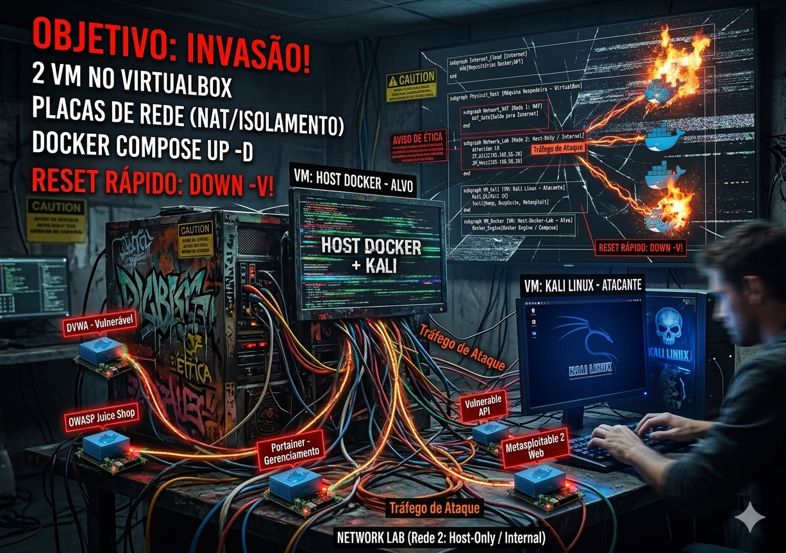

# Laboratorio no VirtualBox (Host Docker + Kali)


---

> [!CAUTION]
> **AVISO DE ETICA E RESPONSABILIDADE**
> Este ambiente e exclusivamente para fins educacionais e de pesquisa em laboratorio controlado.
>
> **Nao utilizar em ambiente produtivo** e **nao atacar sistemas de terceiros** sem autorizacao formal.

---

## Topologia CAOS

<p align="center">
  
</p>

--- 

## Objetivo (o que voce vai montar)

Voce vai montar **2 VMs no VirtualBox**:

- **VM 1 — Host Docker**: roda Docker/Compose e os **alvos vulneraveis** via `docker compose` + **Portainer** para facilitar o uso.
- **VM 2 — Kali Linux**: maquina **atacante**, de onde voce vai acessar as aplicacoes e fazer varreduras.

Os alvos (DVWA, Juice Shop, etc.) rodam em **containers**, dentro do Host Docker.

---

## Pre-requisitos

- VirtualBox instalado.
- ISO do **Kali Linux** (para a VM atacante).
- ISO de **Ubuntu Server** ou **Debian** (para a VM Host Docker).
- Internet (para `apt update` e `docker pull`).

Recomendacao de hardware (para uma experiencia ok):

- **CPU**: 4 vCPU
- **RAM**: 8 GB (minimo 4 GB)
- **Disco**: 30 GB livres

---

## Topologia de rede (simples e segura)

Use **2 placas de rede em cada VM**:

### Placa 1 (NAT) — internet

- Finalidade: atualizar o sistema e baixar imagens Docker.
- Configuracao: **Adapter 1 = NAT**

### Placa 2 (rede do laboratorio) — isolamento

Escolha UMA destas opcoes:

- **Opcao A (mais facil): Host-Only Adapter**
  - Pro: o seu computador (host) tambem enxerga a rede, facil para testar.
  - Contra: menos “isolado” do que Internal Network (mas ainda e um lab controlado).
- **Opcao B (mais isolada): Internal Network**
  - Pro: rede privada so entre as VMs do lab.
  - Contra: o host nao enxerga (isso e bom para isolamento, mas exige mais disciplina).

Config:

- **Adapter 2 = Host-Only** (ex.: `vboxnet0`) **ou** **Adapter 2 = Internal Network** (nome ex.: `labnet`).

---

## Passo a passo — criar as VMs

## 1) Criar a VM “Host Docker”

Sugestao:

- Nome: `Host-Docker-Lab`
- Tipo: Linux (Ubuntu/Debian)
- RAM: 4096 MB (ou mais)
- CPU: 2 (ou mais)
- Disco: 30 GB (dinamico ok)

### Rede da VM (muito importante)

- Adapter 1: **NAT**
- Adapter 2: **Host-Only** (ou **Internal Network** conforme voce escolheu)

### Instalar o sistema (Ubuntu Server / Debian)

Durante a instalacao:

- Crie um usuario (ex.: `lab`) e senha.
- Ative SSH se o instalador oferecer (opcional, mas ajuda).

Depois de instalar, entre na VM e rode:

```bash
sudo apt update && sudo apt -y upgrade
```

---

## 2) Criar a VM “Kali”

Sugestao:

- Nome: `Kali-Lab`
- RAM: 4096 MB (ou 2048 MB se estiver apertado)
- CPU: 2
- Disco: 25 GB (ou mais)

### Rede da VM

- Adapter 1: **NAT**
- Adapter 2: **o mesmo** que no Host Docker (Host-Only `vboxnet0` OU Internal `labnet`)

Depois de instalar o Kali:

```bash
sudo apt update && sudo apt -y upgrade
```

---

## Passo a passo — configurar IPs na rede do laboratorio (Adapter 2)

Voce precisa que as duas VMs se enxerguem pela rede do laboratorio.

Escolha um bloco de IP. Exemplo (Host-Only comum):

- Rede: `192.168.56.0/24`
- Host Docker: `192.168.56.10`
- Kali: `192.168.56.20`

> Se estiver usando Host-Only, o VirtualBox geralmente cria `192.168.56.1` no host. Tudo bem.

### 1) Descobrir o nome da interface no Linux

No Host Docker (e no Kali), rode:

```bash
ip a
```

Procure a interface do Adapter 2 (geralmente `enp0s8`).

### 2) Configurar IP (metodo rapido com NetworkManager, se existir)

Se sua distro usar NetworkManager, voce pode usar `nmtui`:

```bash
sudo nmtui
```

Configure IPv4 manual:

- Host Docker: `192.168.56.10/24`
- Kali: `192.168.56.20/24`

Gateway/DNS nessa rede nao e obrigatorio (a internet vem do NAT).

### 3) Testar conectividade

Do Kali, ping no Host Docker:

```bash
ping -c 3 192.168.56.10
```

Se falhar:

- confira se Adapter 2 esta correto em ambas as VMs
- confira se o IP esta na mesma rede /24
- confira firewall local (normalmente nao bloqueia ping, mas pode)

---

## Passo a passo — instalar Docker + Compose no Host Docker

No Host Docker:

```bash
sudo apt update
sudo apt -y install ca-certificates curl gnupg
```

Instalacao do Docker (caminho simples via repositorio da distro pode funcionar, mas recomendo o Docker oficial quando possivel).

Se voce preferir o caminho simples (Debian/Ubuntu):

```bash
sudo apt -y install docker.io docker-compose-plugin
sudo systemctl enable --now docker
docker --version
docker compose version
```

Adicionar seu usuario ao grupo docker (para nao precisar de `sudo`):

```bash
sudo usermod -aG docker $USER
newgrp docker
docker ps
```

---

## Passo a passo — obter o compose do laboratorio e subir tudo

O laboratorio ja tem um `docker-compose.yml` versionado no repositorio.

Se voce clonou o repo dentro do Host Docker, navegue ate:

```bash
cd 2026-04-Vulnerabilidades_e_Testes_de_Invasao/lab-seguranca
docker compose up -d
docker compose ps
```

Se voce NAO clonou o repo na VM e quer baixar so o compose:

```bash
mkdir -p ~/lab-seguranca && cd ~/lab-seguranca
curl -fsSL -O https://raw.githubusercontent.com/charles-josiah/Aulas/master/2026-04-Vulnerabilidades_e_Testes_de_Invasao/lab-seguranca/docker-compose.yml
docker compose up -d
docker compose ps
```

---

## Acesso as aplicacoes (a partir do Kali)

Use o **IP do Host Docker na rede do laboratorio** (ex.: `192.168.56.10`) e as portas publicadas.

Exemplos:

- Portainer: `https://192.168.56.10:9443`
- DVWA: `http://192.168.56.10:8080`
- Juice Shop: `http://192.168.56.10:3000`
- Vulnerable API: `http://192.168.56.10:8888`
- Metasploitable2 (web): `http://192.168.56.10:8181`

Na primeira vez no Portainer, crie o usuario admin e escolha o ambiente “local” (ele ve o Docker via socket).

---

## Como descobrir IPs dos containers (para rede interna Docker)

Em geral, do Kali voce acessa pelo **IP do Host Docker + portas**.

Para exercicios de rede interna (entre containers), voce pode ver os IPs assim (no Host Docker):

```bash
cd /caminho/para/pasta/com/docker-compose.yml
docker compose ps -q | xargs -I {} docker inspect --format '{{.Name}} {{range .NetworkSettings.Networks}}{{.IPAddress}} {{end}}' {}
```

Ou inspecionando a rede:

```bash
docker network ls | grep lab
docker network inspect <nome_da_rede>
```

---

## Checklist de validacao (antes de comecar a aula)

- Kali pinga o Host Docker na rede do lab.
- `docker compose ps` no Host Docker mostra tudo como `running`.
- No Kali, abre:
  - `http://<IP_HOST_DOCKER>:8080` (DVWA)
  - `http://<IP_HOST_DOCKER>:3000` (Juice Shop)
  - `https://<IP_HOST_DOCKER>:9443` (Portainer)

---

## Reset rapido (para recomecar a aula)

Na pasta do compose (Host Docker):

```bash
docker compose down -v
docker compose up -d
```

