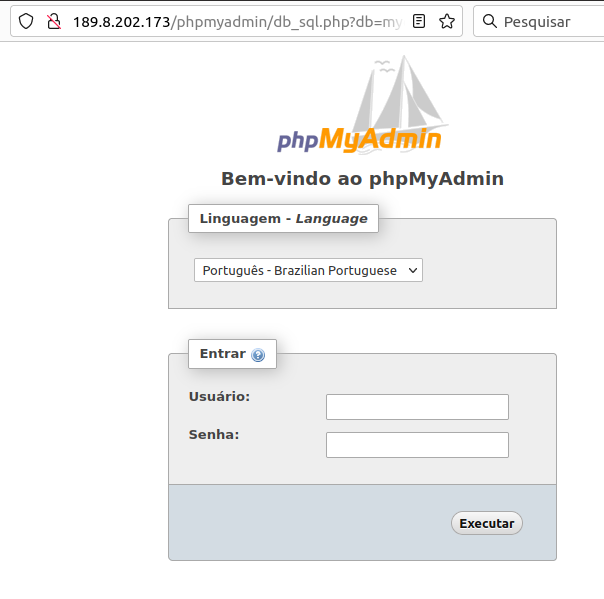
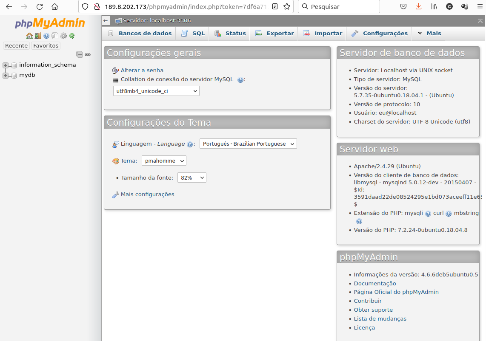
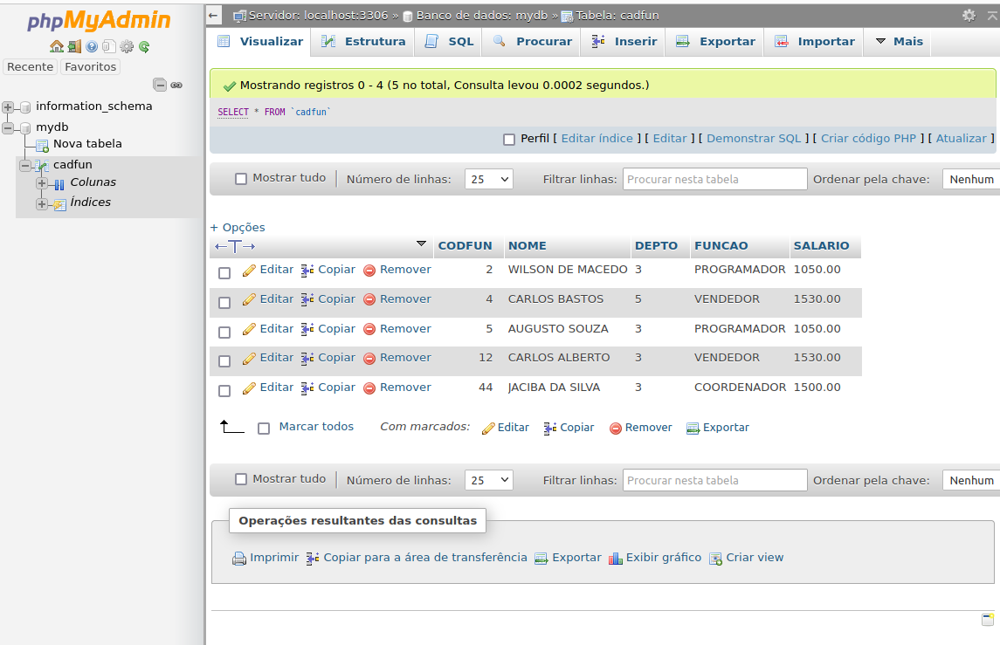
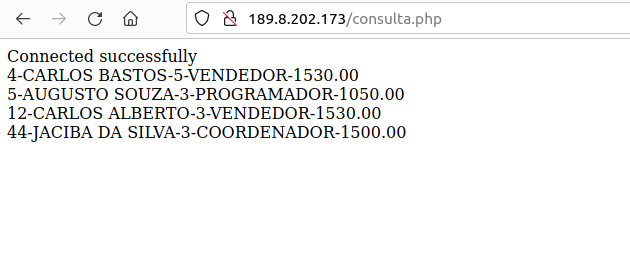

# Instalação MySQL Server no Ubuntu

<hr>
Author: Charles Josiah <br>
Email: charles.alandt(at)gmail.com
<hr>

## Pré-requisitos

Antes de iniciar este tutorial, você precisará do seguinte:

* Acesso a um servidor linux Ubuntu 20.04 
* Acesso root ou permissão de superusuário
* Liberação de firewalls tanto no servidor quanto na infraestrutura.

# 1 - Instalando os pacotes basicos 
````
#> su - 
#> apt-get install mysql-server
#> apt-get install php
#> apt-get install php-mysql 
#> apt-cache search phpmyadmin
#> apt-get install phpmyadmin
#> cp -r /usr/share/phpmyadmin/ /var/www/html/phpmyadmin 

````

Instalado e rodando.... Vamos validar :D 
````
#>  systemctl status mysql.service 

● mysql.service - MySQL Community Server
   Loaded: loaded (/lib/systemd/system/mysql.service; enabled; vendor preset: enabled)
   Active: active (running) since Thu 2021-09-02 00:10:33 UTC; 14h ago
  Process: 27473 ExecStart=/usr/sbin/mysqld --daemonize --pid-file=/run/mysqld/mysqld.pid (code=exited, status=0/SUCCESS)
  Process: 27454 ExecStartPre=/usr/share/mysql/mysql-systemd-start pre (code=exited, status=0/SUCCESS)
 Main PID: 27475 (mysqld)
    Tasks: 31 (limit: 2314)
   CGroup: /system.slice/mysql.service
           └─27475 /usr/sbin/mysqld --daemonize --pid-file=/run/mysqld/mysqld.pid

Sep 02 00:10:32 srvweb01 systemd[1]: Starting MySQL Community Server...
Sep 02 00:10:33 srvweb01 systemd[1]: Started MySQL Community Server.

````
Tudo verinho e status de running...
Agora vamos colocar algumas informações dentro do nosso banco.

# 2 - Inserir um usuario e um banco de dados de teste

````
#> mysql -u root    #Acessar o banco de dados via root
mysql> CREATE DATABASE mydb CHARACTER SET utf8 COLLATE utf8_bin;    # criando a database com encondig utf8 
mysql> create user 'eu'@'localhost' IDENTIFIED BY  'mamaemeama';    # adicionando o usuario com login "eu", permitindo somente acesso pela localhost e com a senha "mamaemeama"
mysql> grant all on mydb.* to  'eu'@'localhost' ;   #garantir que o usuario "eu" tenha acesso "full" ao base "mydb"
mysql> grant create on mydb.* to  'eu'@'localhost' ;    #garantir que o usuario "eu" tenha acesso "full" ao base "mydb"
mysql> FLUSH PRIVILEGES;

````
Vamos criar uma tabelina, e alguns inserts para brincarmos...

````
#> mysql -u root
mysql> use mydb
mysql> 
mysql> 
mysql> #### Criar uma estrutura de uma tabela:
mysql> 
create table cadfun2 ( 
    CODFUN  integer not null primary key,
 	NOME    varchar(40) not null,
    DEPTO    char( 2),
    FUNCAO  char(20),
    SALARIO  decimal(10, 2)
);
mysql> INSERT INTO cadfun (CODFUN, NOME, DEPTO, FUNCAO, SALARIO)  VALUES (12, 'CARLOS ALBERTO', '3', 'VENDEDOR', 1530.00);
mysql> INSERT INTO cadfun (CODFUN, NOME, DEPTO, SALARIO)  VALUES (44, 'JACIBA DA SILVA', '3', 1500.00);
mysql> INSERT INTO cadfun VALUES (2, 'WILSON DE MACEDO', '3', 'PROGRAMADOR', 1050.00);
mysql> INSERT INTO cadfun VALUES (5, 'AUGUSTO SOUZA', '3', 'PROGRAMADOR', 1050.00);
mysql> INSERT INTO cadfun (CODFUN, NOME, DEPTO, FUNCAO, SALARIO)  VALUES (4, ‘CARLOS BASTOS’, ‘5', 'VENDEDOR', 1530.00);
mysql> INSERT INTO cadfun (CODFUN, NOME, DEPTO, FUNCAO, SALARIO)  VALUES (25, ‘PEDRO SILVA’, ‘3', ‘SUPERVISOR', 1599.51);
mysql> INSERT INTO cadfun (CODFUN, NOME, DEPTO, FUNCAO, SALARIO)  VALUES (3, ‘ANA BASTOS’, ‘5', 'VENDEDORA', 1530.00);
mysql> INSERT INTO cadfun (CODFUN, NOME, DEPTO, FUNCAO, SALARIO) VALUES (10, ‘PAULO DA SILVA’, ‘2', ‘VENDEDOR’, 1530.00);

````
Para validar podemos executar alguns comando via mysql, ou acessar novamente o phpmyadmin via browser, com o usuario e senha criado nos passos anteriores.

Conforme imagens:




# 3 - Alguns comandos para treinar...

```
#> mysql -u
mysql> use mydb
mysql> INSERT INTO cadfun (CODFUN, NOME, DEPTO, FUNCAO, SALARIO)  VALUES (12, 'CARLOS ALBERTO', '3', 'VENDEDOR', 1530.00);
mysql> INSERT INTO cadfun (CODFUN, NOME, DEPTO, SALARIO)  VALUES (44, 'JACIBA DA SILVA', '3', 1500.00);
mysql> INSERT INTO cadfun VALUES (2, 'WILSON DE MACEDO', '3', 'PROGRAMADOR', 1050.00);
mysql> INSERT INTO cadfun VALUES (5, 'AUGUSTO SOUZA', '3', 'PROGRAMADOR', 1050.00);
mysql> INSERT INTO cadfun (CODFUN, NOME, DEPTO, FUNCAO, SALARIO)  VALUES (4, ‘CARLOS BASTOS’, ‘5', 'VENDEDOR', 1530.00);
mysql> INSERT INTO cadfun (CODFUN, NOME, DEPTO, FUNCAO, SALARIO)  VALUES (25, ‘PEDRO SILVA’, ‘3', ‘SUPERVISOR', 1599.51);
mysql> INSERT INTO cadfun (CODFUN, NOME, DEPTO, FUNCAO, SALARIO)  VALUES (3, ‘ANA BASTOS’, ‘5', 'VENDEDORA', 1530.00);
mysql> INSERT INTO cadfun (CODFUN, NOME, DEPTO, FUNCAO, SALARIO) VALUES (10, ‘PAULO DA SILVA’, ‘2', ‘VENDEDOR’, 1530.00);
mysql> INSERT INTO cadfun (CODFUN, NOME, DEPTO, FUNCAO, SALARIO)  VALUES (9, ‘SOLANGE PACHECO’, ‘5', ‘SUPERVISORA’, 1599.51);
mysql> INSERT INTO cadfun (CODFUN, NOME, DEPTO, FUNCAO, SALARIO)  VALUES (6, ‘MARCELO SOUZA’, '3', ‘ANALISTA’, 2250.00);
mysql> INSERT INTO cadfun (CODFUN, NOME, DEPTO, FUNCAO, SALARIO)  VALUES (1, ‘CELIA NASCIMENTO’, ‘2', ‘SECRETARIA’, 1200.50);
mysql> SELECT * FROM cadfun;
mysql> SELECT NOME, FUNCAO FROM cadfun;
mysql> SELECT NOME, CODFUN FROM cadfun WHERE DEPTO = ‘3’;
mysql> SELECT NOME, SALARIO FROM cadfun ORDER BY NOME;
mysql> SELECT NOME, SALARIO FROM cadfun ORDER BY NOME DESC;
mysql> SELECT NOME, SALARIO FROM cadfun ORDER BY NOME DESC;
mysql> SELECT DEPTO, NOME FROM cadfun ORDER BY DEPTO, NOME DESC;
mysql> SELECT NOME FROM cadfun WHERE DEPTO = ‘3’ ORDER BY NOME;
mysql> SELECT * FROM cadfun WHERE CODFUN = 7;
mysql> UPDATE cadfun SET SALARIO = 2300.56 WHERE CODFUN = 7;
mysql> SELECT * FROM cadfun WHERE CODFUN = 7;
mysql> SELECT * FROM cadfun WHERE NOME = 'ANA BASTOS';
mysql> UPDATE cadfun SET DEPTO = '3' WHERE NOME = 'ANA BASTOS';
mysql> SELECT * FROM cadfun WHERE NOME = 'ANA BASTOS';
mysql> DELETE FROM cadfun WHERE DEPTO = '2';
mysql> SELECT * FROM cadfun;
mysql> SELECT DISTINCT DEPTO FROM cadfun;
mysql> DELETE FROM cadfun WHERE NOME = 'MARCELO SOUZA';
mysql> SELECT * FROM cadfun;
mysql> ALTER TABLE cadfun ADD ADMISSAO DATE;
mysql> SELECT * FROM cadfun;
mysql> UPDATE cadfun SET ADMISSAO = '2006-01-15' WHERE CODFUN = 2;
mysql> UPDATE cadfun SET ADMISSAO = '1999-10-21' WHERE CODFUN = 3;
mysql> UPDATE cadfun SET ADMISSAO = '2004-10-21' WHERE CODFUN = 4;
mysql> UPDATE cadfun SET ADMISSAO = '2006-04-26' WHERE CODFUN = 5;
mysql> UPDATE cadfun SET ADMISSAO = '1980-05-10' WHERE CODFUN = 7;
mysql> UPDATE cadfun SET ADMISSAO = '1999-12-15' WHERE CODFUN = 9;
mysql> UPDATE cadfun SET ADMISSAO = '2000-12-21' WHERE CODFUN = 12;
mysql> UPDATE cadfun SET ADMISSAO = '2000-10-21' WHERE CODFUN = 25;
mysql> SELECT * FROM cadfun;
mysql> INSERT INTO cadfun VALUES (15, 'MARCOS HENRIQUE', '2', 'GERENTE', 2184.33, '2006-05-25');
mysql> INSERT INTO cadfun VALUES (20, 'AUDREY TOLEDO', '2', 'SUPERVISORA', 1700.00, '2006-07-05');
mysql> INSERT INTO cadfun VALUES (22, 'SANDRA MANZANO', '2','ANALISTA', 2000.00, '2006-07-01');
mysql> INSERT INTO cadfun VALUES (24, 'MARCIO CANUTO', '2', 'PROGRAMADOR', 1200.00, '2006-07-10');
mysql> SELECT * FROM cadfun;


# 4 - Integração basica usando PHP para exibir alguns dados no navegador...

No diretorio htdoc do nosso servidor web, no meu caso, no /var/www/html

```
root@srvweb01:/var/www/html# vi consulta.php 
<html>
	<head>
	<title>Extraindo dados de um  Banco de Dados</title>
	</head>
	<body>

	<?php

	ini_set('display_errors', 1);
	ini_set('display_startup_errors', 1);
	error_reporting(E_ALL);
	// Conexão com o Banco de Dados - Atualizar conforme a sua instalação
	$conn = mysqli_connect("127.0.0.1", "eu", "mamaemeama", "mydb");

	if ($conn->connect_error) {
	  die("Connection failed: " . $conn->connect_error);
	}	echo "Connected successfully";

	$strSQL = "select * from cadfun";

	mysqli_query($conn, $strSQL) or die('Erro na tabela1'); 

	$result = mysqli_query($conn, $strSQL);
	$row = mysqli_fetch_array($result);

	echo "<br>";
	while ($row = mysqli_fetch_array($result)) {
		 echo $row['CODFUN'].'-'.$row['NOME'].'-'.$row['DEPTO'].'-'.$row['FUNCAO'].'-'.$row['SALARIO']."<br>";
        }
	?>
	</body>
</html>
```
E feito isso, "bora" conferir no navegador se apresentou alguns dados....
